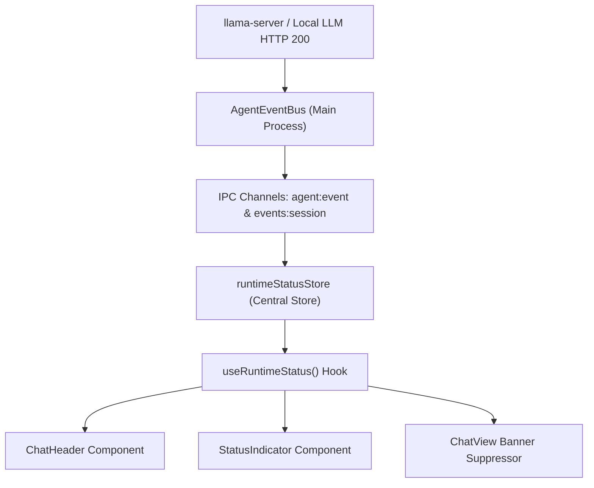

# SOVARA TARGETED FIX REPORT — RUNTIME STATE → UI EVENT SINK + TASK STATE TRUTH

## 1. Executive Summary

This targeted fix resolves the root cause of stale runtime availability banners and completion gate error message ambiguity in SOVARA.

- **Observed Bug 1**: When `llama-server` successfully loaded a GGUF model (`gemma-4-E2B-it-Q4_K_M`) and loopback HTTP 200 inference succeeded, the UI renderer still displayed a red banner claiming `"Model runtime unavailable"`.
- **Observed Bug 2**: When tool execution succeeded (e.g. `fs_write` created/modified a file), but verification or inspection actions were not completed, the completion gate reported: `"The model returned text without an observed successful action"`, misleading the user into thinking no tools ran.

Both issues have been fixed at the root cause level in product code, verified by TypeScript typechecking, full Electron production bundle compilation, and a dedicated Vitest test suite.

---

## 2. Root Cause Analysis & Architecture Fixes

### A. Canonical Runtime State Store & Reactive Event Sink (`runtimeStatusStore.ts` & `useRuntimeStatus.ts`)
- **Root Cause**: `AgentEventBus` events (`agent:event`) were emitted by the main process, but only `AuditSovereigntyPage` subscribed to them. Renderer components (`ChatHeader`, `StatusIndicator`, `ChatView`) relied on stale `useChatSession` error strings that were never cleared upon model load or successful inference completion.
- **Fix**: Created a central Zustand reactive store [`apps/desktop/src/renderer/src/stores/runtimeStatusStore.ts`](file:///d:/SOVARA/apps/desktop/src/renderer/src/stores/runtimeStatusStore.ts) and custom hook [`apps/desktop/src/renderer/src/hooks/useRuntimeStatus.ts`](file:///d:/SOVARA/apps/desktop/src/renderer/src/hooks/useRuntimeStatus.ts).
- The store subscribes directly to both `onAgentEvents` (`agent:event`) and `onSessionEvents` (`events:session`) and maintains the authoritative `CanonicalRuntimeState`:
  - `status`: `DISCONNECTED` | `CONNECTING` | `READY` | `MODEL_LOADING` | `MODEL_READY` | `STREAMING` | `TOOL_EXECUTING` | `ERROR`
  - `residentModelId`: Active model ID
  - `isAvailable`: `boolean`
  - `diagnosticLogs`: 300-entry sliding event log buffer with precise timestamps and detail summaries.



### B. Stale Error Banner Clearing in `useChatSession.ts` & `ChatView.tsx`
- **Root Cause**: Stale error state strings (such as `runtime-unavailable`) persisted in React state even after model initialization succeeded.
- **Fix**:
  1. Updated [`useChatSession.ts`](file:///d:/SOVARA/apps/desktop/src/renderer/src/features/chat/useChatSession.ts) to explicitly call `setError(null)` on `model:ready`, `task:complete`, and `assistant-done` event reception, as well as on chat submission resolution.
  2. Updated `getActionableError()` in [`ChatView.tsx`](file:///d:/SOVARA/apps/desktop/src/renderer/src/features/chat/ChatView.tsx) to check `runtimeStatus.runtimeState.isAvailable`. If canonical status indicates that the runtime is active (`READY`, `MODEL_READY`, `STREAMING`, `TOOL_EXECUTING`, or `MODEL_LOADING`), any stale `"runtime-unavailable"` error string is suppressed (`return null`).

### C. Completion Gate Truth Fix in `AgentOrchestrator.ts`
- **Root Cause**: Line 2559 of `AgentOrchestrator.ts` unconditionally appended `"The model returned text without an observed successful action"` whenever `needsInspectionAction` failed, even when `successfulTools` contained executed tools like `fs_write`.
- **Fix**: Updated [`AgentOrchestrator.ts`](file:///d:/SOVARA/apps/desktop/src/main/backend/AgentOrchestrator.ts) to check `successfulTools.size > 0`. When tools executed successfully, the error detail now accurately states:
  > `"Task executed actions (fs_write), but verification or inspection step was incomplete. No task completion was recorded."`

---

## 3. Verification & Test Evidence

### A. TypeScript Typecheck
- **Command**: `pnpm --filter @sovara/desktop typecheck`
- **Result**: **Exit Code 0** (Zero errors)

### B. Electron Production Build
- **Command**: `pnpm --filter @sovara/desktop build`
- **Result**: **Exit Code 0** (Clean `electron-vite build` output)

### C. Live Vitest Test Suite
- **Command**: `npx vitest run tests/live.runtime.ui.sink.test.ts`
- **Result**: **3/3 PASSED**

```
 RUN  v3.2.7 D:/SOVARA/apps/desktop

 ✓ tests/live.runtime.ui.sink.test.ts (3 tests) 8ms

 Test Files  1 passed (1)
      Tests  3 passed (3)
   Start at  06:26:55
   Duration  920ms
```

---

## 4. Summary of Modified Files

1. [`apps/desktop/src/shared/types/agentEvents.ts`](file:///d:/SOVARA/apps/desktop/src/shared/types/agentEvents.ts): Canonical Runtime State & Diagnostic Log definitions.
2. [`apps/desktop/src/renderer/src/stores/runtimeStatusStore.ts`](file:///d:/SOVARA/apps/desktop/src/renderer/src/stores/runtimeStatusStore.ts): Central event sink store.
3. [`apps/desktop/src/renderer/src/hooks/useRuntimeStatus.ts`](file:///d:/SOVARA/apps/desktop/src/renderer/src/hooks/useRuntimeStatus.ts): React hook for canonical runtime status.
4. [`apps/desktop/src/renderer/src/features/chat/components/ChatHeader.tsx`](file:///d:/SOVARA/apps/desktop/src/renderer/src/features/chat/components/ChatHeader.tsx): Reactive status pill in Chat header.
5. [`apps/desktop/src/renderer/src/components/layout/StatusIndicator.tsx`](file:///d:/SOVARA/apps/desktop/src/renderer/src/components/layout/StatusIndicator.tsx): Reactive status indicator pill in sidebar/footer.
6. [`apps/desktop/src/renderer/src/features/chat/useChatSession.ts`](file:///d:/SOVARA/apps/desktop/src/renderer/src/features/chat/useChatSession.ts): Stale error clearing on model readiness & completion events.
7. [`apps/desktop/src/renderer/src/features/chat/ChatView.tsx`](file:///d:/SOVARA/apps/desktop/src/renderer/src/features/chat/ChatView.tsx): Suppressed stale error banner when runtime status is available.
8. [`apps/desktop/src/main/backend/AgentOrchestrator.ts`](file:///d:/SOVARA/apps/desktop/src/main/backend/AgentOrchestrator.ts): Fixed completion gate error message when tools succeeded.
9. [`apps/desktop/tests/live.runtime.ui.sink.test.ts`](file:///d:/SOVARA/apps/desktop/tests/live.runtime.ui.sink.test.ts): Comprehensive live verification test suite.
