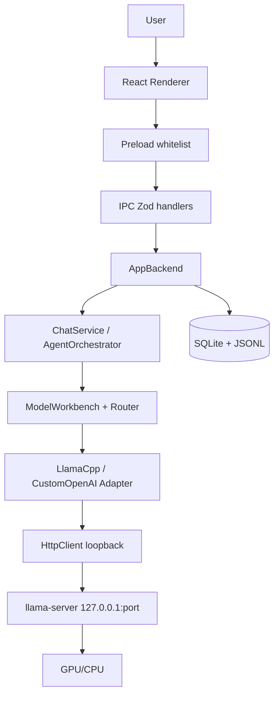
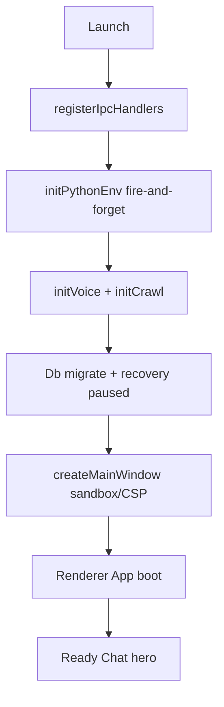
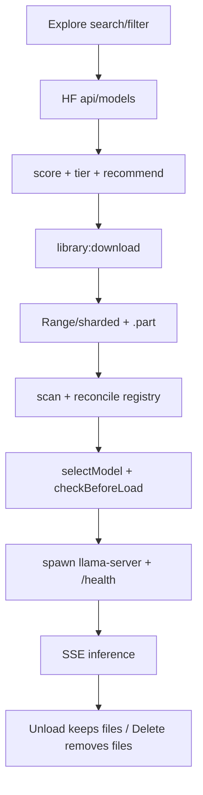
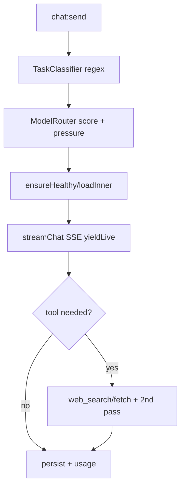
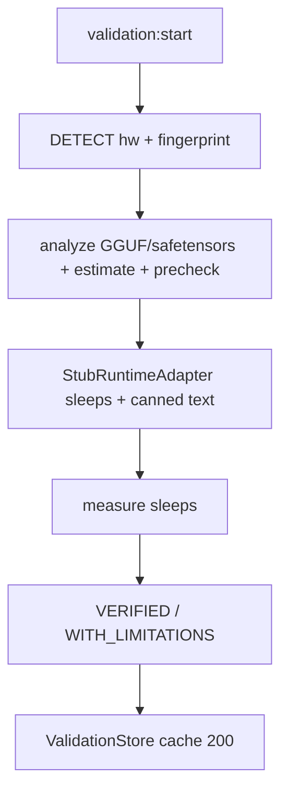

# SOVARA — Complete Application Documentation

> **Method:** evidence-based audit of `D:\SOVARA` as it exists on disk (September 2026).
> Every claim below is traced to an implementation file. Where docs and code disagree, code wins and the gap is called out.
> Status legend: **Implemented** = works and wired · **Partial** = works but incomplete · **Prototype** = works, non-production · **Mocked/Placeholder** = UI/API without real operation · **Planned** = mentioned only · **Unknown** = no evidence.

---

## 1. Executive Summary

SOVARA is a **sovereign, offline-first AI desktop workbench for Windows** — a single Electron app (`apps/desktop`, `@sovara/desktop 0.1.0`) that lets a user chat with **locally-run LLMs**, browse/download models from Hugging Face, manage a local model library, select/probe loopback runtimes (LM Studio / Ollama / vLLM / llama.cpp server / custom OpenAI-compatible), and run an owned `llama.cpp` sidecar (`llama-server` b10900 CUDA) for GGUF inference. All persistence is local (SQLite + append-only JSONL); all inference/storage traffic is loopback (`127.0.0.1`/`localhost`/`::1`) except explicit HF/DDG/GitHub/update-feed fetches. Voice (faster-whisper STT) and web-search/crawl (crawl4ai + DDG fallback) run as loopback Flask sidecars.

The **README (`README.md:6-15`) is stale**: it claims "No real inference yet — chat answers come from a deterministic local stub." That was Phase 1. The current code has **real inference**: `ChatService.send()` (`src/main/backend/ChatService.ts:114-366`) + `AgentOrchestrator.execute()` (`src/main/backend/AgentOrchestrator.ts:103-563`) stream from loopback `POST {endpoint}/v1/chat/completions` via `LocalOpenAIChatAdapter.streamChat()` (`src/main/backend/ports/LocalOpenAIChatAdapter.ts:111-169`) with SSE, plus owned `LlamaCppServerAdapter` spawn/health/load (`src/main/backend/ports/LlamaCppServerAdapter.ts:296-453`). Legacy stubs (`ModelRuntimeStub`, `LlmStubAdapter`) still ship but are **not** on the active path (`AppBackend.ts:65` uses `LlamaCppServerAdapter`).

**Current maturity: Functional MVP / late Beta for local-chat + model-management; Prototype for agents/MCP/skills/validation.** Chat, Models workbench, Explore (HF catalog + downloads), Library, Loaded Instances, settings, persistence, voice STT, and web tools are implemented. Validation `VERIFIED` badges are **mocked** (stub runtime, never loads the model — `services/modelValidationRunner.ts:25-59`). Agent Studio (except Connected Apps) is mocked. Top-level Skills/Library/Runtime nav targets are `Coming soon` placeholders.

---

## 2. Product Overview

| Item | Detail |
|---|---|
| Name | SOVARA — Sovereign AI Desktop Workbench |
| Form | Windows desktop app (Electron 35, `appId: com.sovara.desktop`, `electron-builder.yml`, NSIS x64, `publish: null` — offline, no auto-update install) |
| Tagline (code) | "On-premise, offline-first AI workbench for confidential industrial work" (`README.md:3`) |
| Who | Engineers/analysts handling confidential data who cannot use cloud LLMs; local-first power users with NVIDIA GPUs |
| What user can do today | Chat with local models (streaming, reasoning, web-search opt-in, attach, mic); install/probe/select loopback runtimes; browse HF with hardware-aware fit badges + download (resume/pause/sharded/vision-companion); manage library; monitor/unload instances; configure MCP servers, skills, exec modes, appearance, usage |
| What user cannot do yet | Trust validation `VERIFIED` (mocked); run full autonomous agents (except web tools); use top-level Skills/Library/Runtime pages; RAG/embeddings/TTS; remote/cloud inference; auto-update install |
| Repo | `D:\SOVARA`, `pnpm@11.17 + node>=22`, workspace `apps/*` (only `apps/desktop`), `LICENSE: MIT 2026` |

---

## 3. Problem Statement

Confidential industrial work cannot go to cloud APIs (data residency, IP leakage, air-gap, telemetry). Generic local-model launchers lack: (a) hardware-aware compatibility prediction, (b) durable auditable session store, (c) strict loopback sovereignty guarantees, (d) integrated STT + web-grounding sidecars, (e) honest resource-pressure blocking. SOVARA solves this by: local-only inference over loopback, SQLite+JSONL source of truth, `SystemResourceStub.checkBeforeLoad` blocking gates, isolated-pool VRAM/RAM estimator, and per-request metadata-only logging (`logging/runtimeLog.ts` — origin+path+latency, never bodies/secrets).

---

## 4. Application Architecture

```text
User
 ↓
React 18 Renderer (no fs/net/db)
 ↓ window.sovara.invoke/on (typed, 807-line wrapper)
Preload contextBridge whitelist (preload/preload.ts)
 ↓ IPC invoke (Zod-validated) / webContents.send push
Electron Main: handlers.ts → AppBackend (composition root)
 ↓ Ports (Persistence/LLM/Tools/Models/Resources/Knowledge/Hermes/DSH)
Adapters: SqlitePersistenceAdapter, LlamaCppServerAdapter (owned),
  CustomOpenAICompatibleAdapter, LocalOpenAIChatAdapter, ToolStubAdapter,
  SystemResourceStub (real readings despite name), McpStore, SkillsScanner
 ↓ Loopback-only HttpClient (DNS-verified) + node:sqlite + fs + child_process
Hardware (CPU/RAM/NVIDIA via nvidia-smi/wmic/powershell) + owned llama-server procs
 + Python sidecars (whisper :51820, crawl :51821) + HF/DDG/GitHub (explicit only)
```

Only components that exist are shown. There is **no** Express/Fastify server, no cloud backend, no Utility-process split, no vector DB, no TTS, no native LLM binding (all inference is HTTP to a loopback server process).

### Component table

| Component | Purpose | Location | Main files | Inputs → Outputs | Dependencies | Talks to |
|---|---|---|---|---|---|---|
| Renderer | Chat/Models/Explore/Library/Settings/Agents UI | `src/renderer/src/` | `App.tsx`, `features/chat/ChatView.tsx`, `features/explore/ExplorePage.tsx`, `lib/ipc.ts` | user gestures → `sovara.invoke` | React/Zustand/lucide | Preload only |
| Preload | Whitelist bridge | `src/preload/preload.ts` | `preload.ts` | IPC channel → renderer promise/event | `shared/ipc/channels.ts` | Main ↔ Renderer |
| IPC handlers | Validate + route + broadcast | `src/main/ipc/handlers.ts` (747 lines) | `handlers.ts`, `shared/ipc/schemas.ts` | Zod payload → backend call | `backendComposition.getBackend()` | AppBackend |
| AppBackend | Singleton orchestrator | `src/main/backend/AppBackend.ts` | `AppBackend.ts`, `backendComposition.ts` | IPC intent → port calls | All ports/services/stores | DB/JSONL/runtimes |
| ChatService | Single-turn + regen + edit stream | `src/main/backend/ChatService.ts` | `ChatService.ts:114-711` | `sessionId+content` → SSE deltas + persisted events | persistence/llm/workbench/resources | LLM adapter, events |
| AgentOrchestrator | Classify→route→load→stream→tool 2nd pass | `src/main/backend/AgentOrchestrator.ts` | `AgentOrchestrator.ts:103-563` | user task → `agent/trace` + answer | TaskClassifier/ModelRouter/Tools | Same + web/MCP/skills |
| ModelWorkbench | Registry/probe/select | `src/main/backend/ModelWorkbench.ts` | `ModelWorkbench.ts:101-301` | runtime config → probe/list/select | RuntimeConfigStore/HttpClient | Runtimes, DB |
| LlamaCppServerAdapter | Owned llama-server lifecycle | `src/main/backend/ports/LlamaCppServerAdapter.ts` | `LlamaCppServerAdapter.ts:164-609` | GGUF path → `127.0.0.1:port` instance | llamaRuntime service | OS proc, /health |
| Storage | SQLite meta + JSONL truth | `src/main/storage/` | `db.ts`, `jsonl.ts`, `paths.ts` | events → durable files | `node:sqlite`, fs | PersistenceAdapter |
| HttpClient | Sole loopback fetch (aspiration) | `src/main/network/HttpClient.ts` | `HttpClient.ts:1-387` | URL+body → bounded JSON/SSE | undici fetch | Loopback servers |
| Python sidecars | STT + crawl/search | `python/whisper_server.py`, `python/crawl_server.py` | + `services/voiceServer.ts`, `crawlServer.ts`, `pythonEnv.ts` | audio/query → text/sources | faster-whisper/crawl4ai/Flask/waitress | Main via loopback |
| Config | `app_meta` KV + tables | `src/main/config/RuntimeConfigStore.ts` | `RuntimeConfigStore.ts:87-551` | key ↔ SQLite | SovaraDb | All services |

---

## 5. Repository Structure

```text
SOVARA/
├── apps/desktop/               # ONLY app (@sovara/desktop 0.1.0)
│   ├── electron.vite.config.ts # 3 builds: main/preload/renderer
│   ├── electron-builder.yml    # nsis x64, files out/**, extraResources python/
│   ├── python/                 # whisper_server.py, crawl_server.py, requirements.txt
│   ├── resources/icon.png
│   ├── src/main/               # Electron main (see §4)
│   │   ├── index.ts            # single-instance, init sidecars, window, dispose
│   │   ├── window.ts           # frameless 1280x800 sandbox/CSP/permissions
│   │   ├── backend/            # AppBackend, ChatService, ModelWorkbench, ModelRouter,
│   │   │                       # AgentOrchestrator, TaskClassifier, ports/ x10, hermes/ (12 stub dirs)
│   │   ├── ipc/handlers.ts     # ~90 invoke + 4 push channels
│   │   ├── config/RuntimeConfigStore.ts
│   │   ├── storage/db.ts, jsonl.ts, paths.ts
│   │   ├── network/HttpClient.ts
│   │   ├── services/ x20       # downloads, hfCatalog, explorer*, hardware*, llamaRuntime,
│   │   │                       # modelAnalyzer, validationRunner/Store, mcpStore, skillsScanner,
│   │   │                       # agentStudio, execPermissions, updateFeed, webSearch, crawlServer,
│   │   │                       # voiceServer, pythonEnv, modelLocations, hfCatalog
│   │   └── logging/runtimeLog.ts
│   ├── src/preload/preload.ts
│   ├── src/renderer/src/       # App.tsx, main.tsx, layout/, modals/, ui/,
│   │                           # features/{chat,models,settings,explore,library,agents}/, lib/ipc.ts,
│   │                           # stores/chatStore.ts, theme/tokens.ts, styles.css
│   ├── src/shared/             # constants, ipc/channels.ts + schemas.ts,
│   │                           # types/{branded,chat,session,models,modelCapabilities,explore,ports,task,validation}
│   └── tests/ (38 files)       # vitest contracts/persistence/IPC/UI/sovereignty
├── docs/ARCHITECTURE_PHASE1.md (610 lines, DRAFT 2026-09-06 — partially stale)
├── docs/MODEL_HARDWARE_VALIDATION.md (1321 lines, DETECT→VALIDATE spec — validation exec still mocked)
├── test/ (gitignored, never shipped: deepseek-harness, hermes-agent, ZukuriFlow refs)
├── scripts/ (empty placeholder), screenshots/ (empty, gitignored png/jpg)
├── package.json (sovara-root, delegates to desktop), pnpm-workspace.yaml (apps/*)
└── .opencode/ (agent tooling, not app code)
```

**Meaningful source:** `apps/desktop/src/{main,preload,renderer,shared}` + `apps/desktop/tests` + `apps/desktop/python`. Ignore `out/`, `dist/`, `node_modules/`, `test/`, `.opencode/`.

---

## 6. Technology Stack

| Layer | Tech | Why |
|---|---|---|
| Desktop shell | Electron 35.1, electron-vite 3, electron-builder 25 | Window + main/preload isolation, NSIS packaging, `extraResources: python` |
| Renderer | React 18.3.1, Zustand 4.5.2, lucide-react 0.511, Vite 6, TS 5.7 ES2022 strict | Component UI, lightweight stores, icons, HMR build |
| Validation | Zod 3.24 (main-side; renderer never validates) | Every IPC handler `safeParse` |
| Persistence | `node:sqlite` (WAL, `synchronous=NORMAL`, `foreign_keys=ON`, `busy_timeout=5000`) + append-only `events.v1.jsonl` | No extra DB dep; chat derived from events, no messages table |
| Inference transport | Loopback `POST /v1/chat/completions` SSE + `GET /v1/models|/health` | Works with LM Studio/Ollama/vLLM/llama.cpp uniformly |
| Owned runtime | Pinned `llama.cpp b10900` CUDA/CPU zip from GitHub releases, `-ngl 999`, free-port spawn | Reproducible local GGUF serving |
| Python | faster-whisper 1.1.1, Flask 3.1.1 + waitress, crawl4ai ≥0.7, numpy/requests | STT + crawl/search sidecars on `:51820/:51821` |
| Tests | Vitest 3.1 + jsdom 26 + testing-library | Contract/persistence/UI/sovereignty gates |
| Tooling | pnpm 11.17, node ≥22, tsc --noEmit | Monorepo + type gate |

**Flagged:** `pnpm-workspace allowBuilds` lists `onnxruntime-node` but it is not a dependency and no ONNX adapter exists. Doc mentions `better-sqlite3`; code uses built-in `node:sqlite`. `scripts/` empty.

---

## 7. Application Startup

Actual flow (`src/main/index.ts`):

```text
Electron ready → single-instance lock
 ↓ registerIpcHandlers() (handlers.ts)
 ↓ initPythonEnv() [fire-and-forget] → ensurePythonEnv(): system python → venv + marker hash → browsers check
 ↓ initVoiceServer() + initCrawlServer() [fire-and-forget, 30s/45s waitForServer]
 ↓ AppBackend lazy via getBackend() → SovaraDb.migrate() (schema v2) + RuntimeConfigStore tables
 ↓   restart recovery: model_downloads downloading/verifying → paused (RuntimeConfigStore.ts:219)
 ↓ createMainWindow() (window.ts: frameless 1280x800, sandbox, contextIsolation, CSP, mic-only)
 ↓ Renderer boot: index.html → main.tsx → App.tsx → app:getInfo + useChatSession/useModelWorkbench refresh
 ↓ Ready: Chat hero ("What can I help with?"), sidebar projects/chats
```

**What really happens:** hardware detection is **lazy, not at startup** (`getHardwareProfile()` on demand via `explore:getHardwareProfile` / validation start). No model auto-load at startup. Python/sidecars failing does **not** block window — features degrade (web tools fall back to keyless DDG; voice returns `{ok:false}`).

---

## 8. Navigation / Information Architecture

No react-router — manual `activeNav: NavId` in `App.tsx` inside `AppShell` (`TopBar` tabs + `Sidebar` + `<main>`).

```text
Sovara
├── Chat (default, Implemented) — ChatView + Composer + MessageList + ModelSelector + PermissionControl
├── Models (Implemented) — ModelsPage + useModelWorkbench (active model, local runtime install, runtimes CRUD, discovered models, resources)
├── Agents (Partial — shell Implemented, workspaces Mocked except Connected Apps Implemented)
│   └── 13 tabs: overview|instructions|knowledge|skills|connected(real MCP)|tools|memory|workflows|testing|analytics|versions|permissions|settings
├── Settings (Implemented mega-page, 13 sections)
│   ├── general | agent | billing(usage) | appearance | sessions
│   ├── connected-apps (real MCP) | skills (real scan/import)
│   └── explore(real) | library(real) | loaded-instances(real) | local-model-api(real) | local-model-defaults | runtime
├── Skills (Placeholder — "Coming soon … reserved for Phase 2")
├── Library — top-level Placeholder (distinct from Settings→Library which is real)
└── Runtime — top-level Placeholder (distinct from Settings→Loaded Instances which is real)
```

Sidebar `skills|library|runtime` items are `disabled:true` but still render placeholder cards via `App.tsx`. Tab close hides only; permanent delete is sidebar `ChatRow` menu with confirm.

---

## 9. Feature-by-Feature Documentation

### 9.1 Chat — **Implemented**

- **Purpose / problem:** confidential local Q&A with audit trail.
- **UI:** `features/chat/ChatView.tsx` (header `Model … Ready` vs `No model available` + `Open Models`; actionable error banner; `chat-execution` status planning|selecting|loading|ready|streaming|tool|error|cancelled + VRAM bar + `<details>`; `MessageList`; `Composer`). `Composer.tsx`: autosize 160px/32k chars, `Enter` send / `Shift+Enter` newline / `Enter`-while-streaming = Stop, `+` attach (pdf/png/jpg/gif/webp/txt/md, 10MB → base64 chips), `Globe` web-search toggle, `Mic` (getUserMedia→16kHz resample→`voice:transcribe`), `ModelSelector` (search + `Brain` reasoning toggle + `Wrench`→settings), `PermissionControl off|ask|review|allow`.
- **API:** `chat:send/cancel/regenerate/editResend` + push `events:session` (`ChatStreamEvent` in `shared/types/chat.ts`).
- **State:** `useChatSession.ts` (sessions/selectedId/events/draft/busy/phase/execution/streamingText+Reasoning/error/model) with `loadSeq` race guard + `onSessionEvents` handling all stream kinds + completion notification (respects `sessionNotifications`, `document.hidden`).
- **States:** loading (`Streaming…/Loading…/Tool running…`, Thinking/Typing indicators, VRAM bar); error (actionable map: no-model / runtime-unavailable / load-failed+VRAM split / resource-pressure / already-generating + `Open Models/Choose another/Dismiss`); empty (hero + model-aware subtitle); success (persisted `userSeq/assistantSeq`, token usage row).
- **Files:** `ChatView|ChatPage|Composer|MessageList|MessageBubble|ModelSelector|useChatSession|conversation|messageProjection|chatApi|chatStore (+stores/chatStore duplicate)|hooks/useChat{,Stream,Composer}|components/{EmptyChat,ErrorMessage,ChatHeader,MessageActions,GenerationStatus}|TypingIndicator|ThinkingIndicator`.

### 9.2 Models workbench — **Implemented**

`features/models/ModelsPage.tsx` + `useModelWorkbench.ts`: Active-model card (`role=status`, `Selected|Unavailable - probe its runtime`), Sovara Local Runtime card (`Checking…|Installed+version|Not installed + Install` with byte `%`, `MB/s`, ETA on `events:download:__sovara_runtime__`), error banner, Connected-runtimes card (`{n} configured | loopback only`, add `Display name+Endpoint`, per-row `Test/Remove`, `Connected|models|latency|Disconnected|Not probed`), Available-models card (`{n} discovered`, `Select|Active`, `ctx Nk`, unavailable disabled), Resources card (CPU/RAM/GPU/VRAM or `UNKNOWN — no NVIDIA driver`, `models hold N MB`, or `Loading…`). `refresh()` merges `library:listModels` as `Local Library` runtime + auto-selects first; `runGuarded` mutex.

### 9.3 Settings — **Implemented** (13 sections in `features/settings/SettingsPage.tsx` ~2000 lines)

`general` (version/channel, auto-updates, feed URL blur-save, `updates:checkNow`, session notifications, global workspace `pickFolder`); `agent` (tool/model/exploration InfoRows, root/vision selects, web-search toggle + `tools:dispatch web_search` test, exploration toggle, auto-review instructions 4k); `billing` (token totals/distro bar/per-model bars/recent table, 4s poll, `No tokens tracked yet`); `sessions` (rename-after-fork, archived + unarchive); `connected-apps` (real MCP CRUD + presets GitHub/Linear/Notion/Sentry/Atlassian + probe, SimpleIcons logos); `skills` (scan/toggle, bionic add/remove, listDetailed, URL/file import with frontmatter `name:`); `explore|library` (embed real pages); `loaded-instances` (`LoadedInstancesSection.tsx`: Badge/StatusPill, GPU/VRAM/CPU/RAM MetricBars, Uptime/TTFT/tok-s, 2-step Unload, 320ms poll + `events:instances`); `local-model-api` (logs/usage/skills/MCP/tools, 3s poll); `appearance|local-model-defaults|runtime` (theme system|light|dark → `data-theme`, sidebar/diff selects, runtime probes). Helpers `Toggle(role=switch)|InfoRow|ActionButton|McpPreset`.

### 9.4 Explore (HF catalog) — **Implemented** (`features/explore/ExplorePage.tsx` ~1100 lines)

Search (350ms debounce), sort (Recommended|trending|downloads|likes|lastModified|created), 9 filters (format, quant Q2_K…F32, params <3B…70B+, license, capability Vision/Tools/Reasoning/Code/Text/Chat/Embeddings, gated, downloaded, compat), memo `ModelRow` (ModelMark/LetterMark avatar, fit dot likely|possible|unlikely|unknown, CapIcons), detail pane (format-aware formats, read-only RepoFileList, per-file MiniFit/FitBadge, `TOP RECOMMENDED rank 0` preselect, sanitized ReadmeViewer + copy + clamp), download row (byte `%`, MB/s, ETA, Pause/Resume/Cancel/Retry, Open folder, gated blocked, multipart+mmproj sidecar), cursor `Load more`, `genRef` stale-sweep. States: skeleton, degraded `Couldn't refresh — showing previous…`, `Could not load models`, `No files match`, persistent error rows.

### 9.5 Library — **Implemented** (`features/library/LibraryPage.tsx`)

Directory row + `Change` (`library:setDirectory`) + `Radar` detect (`library:detectLocations` LM Studio/Ollama → `Apply`), connected-models list (active green border, `Active|Unavailable`, collapsible `detection.log|runtime.log`), search + sort (latest|name|size) + `Showing N`, per-row size + `InstallStatusChip(installed|missing|unregistered)` + date + `Trash2 Delete` (`library:delete`). Refresh on `events:download done`. States: `Loading models…`, `No models downloaded yet → Go to Explore…`, `No models match filter`, `Scanning drives…`.

### 9.6 Agents — **Partial (shell Implemented, 12/13 workspaces Mocked)**

`features/agents/AgentsPage.tsx` (~1000 lines): left Navigator (hardcoded 5 agents, lifecycle draft|build|active|published, filters all|favorites|recent|team|templates|archived where last two `[]`, `Create New Agent` reselects `ag_01`), 13 workspace tabs, right intel panel. Only `connected` (`McpWorkspace`: list/getDir/openFolder/installFromUrl/toggle/probe/remove, `github.com`+2-parts validation, AI log steps, 10s poll) is real. Others (overview metrics 1,284 runs; prompt textarea + fake preview; knowledge 3 files + 62%; skills/tools/memory/workflows/testing 92%; analytics 342 runs; versions v9-v12; permissions; settings `Delete agent` no-op) are hardcoded.

### 9.7 Top-level Skills/Library/Runtime — **Placeholder**

`App.tsx` renders `Card + EmptyState Coming soon` for these NavIds (explicit Phase-2 stubs: Skill library / KnowledgePort RAG / CPU-RAM-GPU probes). Do not confuse with real `Settings→Skills/Library/Loaded Instances`.

---

## 10. User Workflows (actual code paths)

### 10.1 Chat request

```text
Composer Enter → useChatSession.handleCreate/Send → chat:send {sessionId,content≤32k,webSearch,reasoning}
 ↓ AgentOrchestrator.execute (or ChatService.send fallback)
 ↓ TaskClassifier.classifyTask() (regex toggles; ctx=chars/4+2048 clamp 2k-131k)
 ↓ ModelRouter.routeModel() (exact+40/partial+20/miss-10, ctx+15/-20, size bias, xlarge+lowVRAM-12, checkBeforeLoad skip)
 ↓ ensureHealthy/baseUrl → LlamaCpp loadInner if owned (single-flight, capacity gate, spawn, /health 240s, port-conflict retry)
 ↓ phases on events:session: task:start/planning → model:selecting/loading/ready → step:start/end → assistant-delta/reasoning-delta (yieldLive, no full buffer) → tool:start/delta/end (optional 2nd pass with web context) → task:complete/error/cancelled
 ↓ persist one assistant/message (+reasoning split <thinking>), token fallback, insertTokenUsage
 ↓ resolve {userSeq,assistantSeq} → MessageList autoscroll (80px stickiness)
```

Cancel → `chat:cancel` (AbortController → `assistant/cancelled` marker). Regenerate reuses history without dupe user (`ChatService:372-525`). Edit resends edited user msg.

### 10.2 Model discovery / search / filter / recommend

`ExplorePage` filters (ANDed, N+1-free via `ExplorerListEnv`) → `explore:listModels` (`zExploreListModels`: sort/query/tag/limit1-100/format/quants/params/licenses/capabilities/gated/downloaded/compat/cursor) → `explorerCatalog.listExplorerModelsPage()` (TTL + in-flight dedup) → `fetchHfPage()` (`https://huggingface.co/api/models*` + optional `HF_TOKEN` Bearer) → `scoreExplorerModel()` (tier > capability > usage > size > recency, gated −1) + `bestModelFit/modelCompatTier` + `recommendForHardware()` (keep likely/possible with GGUFs) → rows with fit dots + `TOP RECOMMENDED`.

### 10.3 Download / install / delete vs unload

- **Download:** `library:download {modelId,rfilename,downloadUrl,parts[2..8]?,companion?,revision?,format?,quant?,license?,gated?}` → `modelDownloads.startDownload()` (Range-resume, `.part`, pipeline tap, 2-concurrent + queue, `events:download` progress) or `startModelSetDownload()` (sequential shards, group key = first part, skip-complete, verify-all, `.set.json` sidecar; mmproj companion quiet 2nd `startDownload`, failure never fails weights). Runtime binary: `models:ensureRuntime` → `llamaRuntime.ensureLlamaRuntime()` (pinned b10900 zip via `Expand-Archive` + `--version` self-check, progress on `__sovara_runtime__`).
- **Storage:** `<library>/<author__name>/<rfilename>` (+`.part/.json/.set.json`); registry row (`model_registry`); `isDownloaded` requires every part; size-only check (honestly `Downloaded`, never `Verified`).
- **Install/registration:** `scanLibrary()` + `reconcileLibrary()` (checked/fixed/adopted/unregistered/orphanPartials/missing) → `ModelRegistryRow`.
- **Load:** `models:selectModel {runtimeId,modelId}` → `checkBeforeLoad` (blocking refuses) → `models.load` → `LlamaCpp loadInner` (see §10.1).
- **Unload (keeps files):** `instances:unload {instanceId}` → `unloadInner()`: `EVICTING`, 5s grace for activeRequests, SIGTERM→`taskkill /T /F`, verified exit, `OFFLINE` delete. **Deletion (removes files):** `library:delete {path}` → `deleteLibraryEntry()` removes GGUF. Do not confuse.
- **Delete flow UI:** Library row `Trash2`; instances card 2-step `Unload` confirm.

### 10.4 Hardware detection / validation

`explore:getHardwareProfile` → `hardwareProfile.getFullHardwareProfile()` (nvidia-smi→wmic→powershell, 4s execSync timeouts, negative AdapterRAM clamp, freeVram `undefined` w/o nvidia-smi, <1GB = CPU-only; vendor `NVIDIA` iff name match else `Unknown`; backend `CUDA` iff gpuAvailable else `CPU`) + fingerprint `cpu|gpu|ram|vram|backend|arch|os`. `system:getResources` → `SystemResourceStub.getSnapshot()` (real `os.*` + `getHardwareProfile()` + `listInstances()` aggregate `usedByModelsMB`; disk `unknown/0`). `validation:start {modelId,libraryPath?,ctxLen?}` → `ValidationRunner.start()` detached `void run()` (10 phases DETECT→VALIDATE, precheck gate, warmup×2, 1+4 stability, CPU-fallback→`VERIFIED_WITH_LIMITATIONS`, `finally unload`), 400ms poll → `ValidationStore.put()` (cap 200, `isStillValid` exact hwFp|modelFp|runtimeVer match). **Critical:** runner uses `StubRuntimeAdapter` (statSync + 40/22ms sleeps, canned `Response to:…`) — never wires `LlamaCppServerAdapter` — so `VERIFIED` ≠ real load.

### 10.5 Settings / exec modes / MCP / skills / voice / updates

- Settings `settings:get/set` (strict lengths) → `app_meta` + `ensureGlobalWorkspace()`.
- Exec `exec:getMode/setMode off|ask|review|allow` (default `ask`) → `gateDispatch()` (`off→disabled`, `ask→needs-approval`, `review→safe-prefix auto`, `allow→auto`) enforced in `tools:dispatch`.
- MCP `mcp:list/add/installFromUrl/getDir/openFolder/remove/toggle/probe` → `mcpStore` (32-cap, zod; `probeHttp` loopback-short-circuit else `fetchMcpProbe`; `probeStdio shell:true` 600ms/1.5s; `installMcpFromUrl` github-only, `git clone --depth 1` + `npm install --ignore-scripts`, heuristic command detect). `http` tools forward `tools/call` via `postMcpJsonRpc`; `stdio` returns explicit stub JSON.
- Skills `skills:scan/toggle/listBionic/addBionic/removeBionic/listDetailed/importFromUrl` → `skillsScanner` (`~/.claude/skills`, `~/.agents/skills`, `<userData>/skills`, `<userData>/bionic-skills`, `SKILL.md` frontmatter, 6k budget Bionic-4+2/source) → injected as system context.
- Voice `voice:status/transcribe {audio base64}` → `voiceServer` → `POST 127.0.0.1:51820/transcribe` (faster-whisper base/cpu/int8, VAD, jargon refine, silence RMS<0.005 guard).
- Updates `updates:checkNow` → `updateFeed.checkForUpdates()` (check-only, `{version}` or GitHub `tag_name[]`, semver, `current/available/no-feed/error`; default URL `https://api.github.com/repos/karthik-ak-Git/SOVARA/releases` vs "empty by default" comment — code wins).

---

## 11. Model Lifecycle (mandatory)

```text
Discovery (probe /v1/models, scan **/*.gguf, LM/Ollama detect, HF catalog, registry snapshot)
 ↓ Compatibility (isolated-pool estimator + explorer fit engine + tiers/score)
 ↓ Download (single Range-resume / sharded set / mmproj companion / runtime binary; HF_HOSTS allowlist)
 ↓ Storage (library layout + .part/.set.json + model_downloads/model_registry + token_usage)
 ↓ Registration (scanLibrary/reconcile → ModelRegistryRow; ensureLocalLibraryRuntime auto-creates local runtime)
 ↓ Load (checkBeforeLoad gate → single-flight → capacity/LRU evict → selectRuntimeForModel → spawn → /health → finishLoad observed freeBefore-freeAfter)
 ↓ GPU/CPU alloc (buildServerArgs -m/--host/--port/-c/-ngl 999/--alias/--mmproj; planMemory weights+KV×nParallel+5%+256MB; cuda:0/cpu)
 ↓ Inference (loopback SSE streamChat yieldLive + ChatService/AgentOrchestrator persist + usage)
 ↓ Unload (EVICTING → grace → kill → OFFLINE; files kept)  |  Delete (files removed)
```

Per-stage code/APIs/state/fs/hw/errors/perf: see §§10–12/14/21/25. **Deletion ≠ unloading** (above).

---

## 12. Hardware Detection & Validation

- **CPU/cores/threads/RAM:** `os.cpus()`, `os.totalmem/freemem` via `SystemResourceStub.getSnapshot()` + `hardwareProfile.ts:105-143`.
- **GPU/VRAM:** `nvidia-smi` CSV (`queryGpuVram`, header-tolerant `parseNvidiaSmiCsv`) → wmic → powershell fallbacks; `freeVramMB undefined` without driver; disk `unknown/0`.
- **OS/arch/backend:** `os.platform/release/arch`; backend `CUDA` iff gpuAvailable else `CPU`.
- **Prediction vs Verification:** Prediction = `estimateCompatibility()` (need=file×1.12/1.08+KV 0.42GB/1k@7B params-scaled; VRAM-vs-RAM never summed; 0.92/0.88/0.90 bands) + `explorerFit` (full/partial/fitWithoutGPU/willNotFit; OS 2GB/GPU 0.5GB reserves; 0.9GB vision projector; unknown size→willNotFit) — honest estimate. Verification = `ValidationRunner` 10-phase job — **currently mocked** (stub adapter), so badges are predictions mislabeled as verification.
- **Fits / barely / exceeds / fallback / fail:** `good>tight>too-large` sort (good prefers larger+better quant, `★ Recommended`); tight bands 0.88–0.92; too-large blocked (`checkBeforeLoad` blocking refuses; `SystemResourceStub:77-90` need>total→critical/blocking, need>total-usedByOthers→blocking, same-model short-circuit, VRAM-unknown fail-open); CPU fallback → `VERIFIED_WITH_LIMITATIONS` (stub path); load fail → `classifyLoadFailure()` (only port-conflict recoverable, no `-ngl` auto-reduction); inference fail → `classifyChatError()` (timeout/refused/unauthorized/model-not-found/invalid-response).

---

## 13. Model Compatibility & Recommendation

Real algorithm (not placeholder):

- **Inputs:** `HardwareInfo` (RAM/GPU/VRAM/backend), `ExploreModelFile` (format/quant/sizeGB/URLs), caps, filters, usage (downloads/likes), recency, gated flag.
- **Filters:** 9 ANDed (`matchesAllFilters`, N+1-free env) + `matchesCompatFilter` (tier).
- **Ranking:** `scoreExplorerModel()` tier > capability > usage (`673-688`) > size > recency, gated −1; `recommendForHardware()` keeps likely/possible with GGUFs; `recommendFiles()` sorts good>tight>too-large, good prefers larger+better quant.
- **Rules:** isolated pools (never sum VRAM+RAM); `runnable===false→willNotFit`; `planMemory()`; `checkBeforeLoad` skips blocked candidates; `ModelRouter` exact+40/partial+20/miss−10, ctx+15/−20, size bias, xlarge+lowVRAM−12.
- **Metadata:** `ExploreModel` (params/arch/caps/files/tags/format/license/gated/repoFiles/fitTier), `ExploreModelFile` (format/quant/sizeGB/downloadUrl/rfilename/multipart/parts/companion), `HardwareInfo`, `CompatibilityResult{fitsInMemory,estimatedRamUsageGB,message,severity}`, `FileRecommendationView[]`.
- **Quant/context/VRAM/RAM/perf:** `parseQuantization()` + aliases; `ctx=chars/4+2048` clamp; `estimateVramMB` or 1800 default; `estimateKvCacheGB()`; TTFT/tok-s observed only on real Chat path (validation perf numbers are stub sleeps).
- **Heuristic caveat:** `modelCapabilities.ts` claims "never infer" but falls back to `modelId.includes(family)` substring, unknown→chat-only (**Partial**). `TaskClassifier` is deterministic regex, no LLM.

---

## 14. API Architecture

No REST — **~90 typed IPC `invoke` + 4 `on` push** (`shared/ipc/channels.ts:5-124`, `handlers.ts` 747 lines, `preload.ts` whitelist, `renderer/lib/ipc.ts` wrappers). Representative endpoints (full table in audit; key ones):

```text
invoke app:getInfo {} → {name,version,electron,node,platform,arch} | AppBackend.getInfo() | App.tsx:42
invoke sessions:list/getEvents/create/rename/delete/archive* ↔ SqlitePersistenceAdapter → SovaraDb + jsonl | ConversationList/useChatSession
invoke chat:send {sessionId,content 1..32k,webSearch?,reasoning?} → {userSeq,assistantSeq} + events:session stream | AgentOrchestrator.execute / ChatService.send | chatApi/useChatSession/ChatView
invoke models:listRuntimes/addRuntime/removeRuntime/testConnection ↔ ModelWorkbench + RuntimeConfigStore + CustomOpenAICompatibleAdapter | useModelWorkbench/Settings
invoke models:probeRuntime/ensureRuntime/listModels/selectModel/getActiveModel ↔ LlamaCppServerAdapter + llamaRuntime | ModelsPage
invoke instances:list/unload/getMetrics ↔ LlamaCppServerAdapter | LoadedInstancesSection (320ms poll + events:instances)
invoke explore:listModels/getModel/getCompatibility/getRecommendations/getHardwareProfile ↔ explorerCatalog/hfCatalog/explorerFit/hardwareCheck | ExplorePage
invoke library:listModels/getDirectory/detectLocations/setDirectory/download/cancel/pause/resume/getActiveDownloads/isDownloaded/getFileStatus/reconcile/openFolder/delete ↔ modelDownloads/modelLocations | LibraryPage
invoke skills:*/mcp:*/tools:*/exec:*/settings:*/updates:checkNow/setup:*/usage:*/validation:*/voice:*/logs:getRecent/shell:openExternal/dialog:pickFolder/window:*
on events:session/download/instances (+reserved events:resources) → renderer subscriptions
```

Python sidecars: `GET /health`, `POST /transcribe {wav_base64}|raw`, `POST /search {query,max_pages 1..5}`, `POST /crawl {urls[1..5],max_chars 500..20000}` (Flask+waitress `127.0.0.1` only). Loopback LLM: `POST {endpoint}/v1/chat/completions` (SSE `data:[DONE]`), `GET /v1/models`, `GET /health`. Outbound (explicit): `https://huggingface.co/api/models*` (+`resolve/` weights), `https://html.duckduckgo.com/html/`, `https://github.com/ggerganov/llama.cpp/releases/download/…` (runtime zip), user update-feed URL (default GitHub API releases).

---

## 15. Data Models

- **Branded:** `shared/types/branded.ts: SessionId|ToolCallId|ModelId|InstanceId`.
- **Ports:** `shared/types/ports.ts: LocalModel, ModelInstance{id,modelId,runtimeId,status,ctxLen,port,pid,metrics,state OFFLINE|LOADING|ACTIVE|BUSY_DECODE|EVICTING|FAILED,endpoint,health,hardwareDevice,configuration,estimatedVramMB|observedVramMB}, InstanceMetrics, RuntimeSelection, MemoryPlan, LoadFailureKind, LlmUsage|Chunk|ChatMessage|ChatRequest, LlmPort, ToolDefinition|Port, SessionHeader|ProjectHeader|SessionEventView, PersistencePort, SystemResources, ResourcePressure, SystemResourceManagerPort, KnowledgePort=Record<never>, Hermes|DshPort={available:false}`.
- **Session/events:** `shared/types/session.ts: SessionEventType(user/message,assistant/message,reasoning,cancelled,agent/*,tool/*,system/resource-blocked), SessionEvent, User|Assistant|ToolResultData, SurfaceOp`.
- **Stream:** `shared/types/chat.ts: ChatStreamKind(assistant-delta|reasoning-delta|done|error|cancelled + task:start|planning, model:selecting|loading|ready|failed|unloading, step:start|end, tool:start|delta|end, task:complete|error|cancelled), ChatStreamEvent{sessionId,kind,text?,error?,seq?,taskKind?,modelId?,runtimeId?,stepIndex?,toolName?,vramUsedMB?,detail?}`.
- **Models/explore/validation/task/caps:** `shared/types/{models,explore,validation,task,modelCapabilities}.ts` (see §14 audit for fields) + Zod IPC `shared/ipc/schemas.ts` (zSessions*/zChat*/zModels*/zSkills*/zExplore*/zLibrary*/zShell*/zSettings*/zExecMode/zToolDispatch/zVoice*/zMcp*/zValidation*/zInstanceId/zUsage*).
- **Backend:** `RuntimeConfigStore: RuntimeSnapshot, DownloadRow{id=provider|repo|revision|rfilename,…kind single|set,parts,companion}, ModelRegistryRow{sourceProvider,repository,revision,rfilename,format,quantization,architecture,parameterCount,localPath,fileSizeBytes,checksum,downloadStatus,installStatus,runtimeId,displayName,extraJson}`; `db.ts: DbSessionRow|DbProjectRow`; services: `CrawlSource|Page, WebSearchSource|Outcome, HardwareProfileFull, UpdateCheckResult, McpServer, PythonStatusView, FileRecommendation, LibraryEntry, DownloadEvent, FileStatus{state downloaded|partial|paused|queued|downloading|failed|missing}, ReconcileReport`.
- **Relations:** `Project 1—N Session 1—N events.v1.jsonl (seq-contiguous)`; `Session 1—N token_usage`; `Runtime 1—N DiscoveredModel`; `RegistryRow N—1 local file`; `Instance N—1 RegistryRow + 1 port/pid`; `ValidationJob N—1 model + 1 hwFingerprint`; conceptual ER: `projects → sessions → events → usage`, `runtimes → models → registry → instances`, `downloads → files → registry`.

---

## 16. State Management

```text
User Action (Composer/Sidebar/Models/Explore)
 ↓ useChatSession / useModelWorkbench / local useState (+ persistedExplorerFilters module var)
 ↓ sovara.invoke (typed) → backend change (DB/JSONL/registry/proc)
 ↓ resolve + push (events:session/download/instances)
 ↓ onSessionEvents/onDownloadEvents refresh (loadSeq/stale-sweep/genRef guards)
 ↓ UI update (MessageList autoscroll, VRAM bar, progress rows)
```

- **Global-ish:** `useChatSession` (primary, used by `App.tsx`); duplicate Zustand `stores/chatStore.ts` + `features/chat/stores/chatStore.ts` (present, parallel, not on `App.tsx` path — tech debt); `App.tsx useState` (info/err/nav/tabs/projects/execMode/reasoning/modal/openChatIds).
- **Local:** Explore/Library/Settings/Agents `useState` + intervals (usage 4s, logs 3s, instances 320ms, MCP 10s).
- **Server state:** `RuntimeConfigStore` (`app_meta` + runtimes/downloads/registry) + `SovaraDb` + JSONL; no React-Query; no FTS.
- **Theme:** `theme/tokens.ts` mirrored as CSS vars; `getAppSettings → documentElement[data-theme|data-sidebar|data-diff]` + `matchMedia` listener.

---

## 17. Agents

**Implemented:** `AgentOrchestrator` + `ChatService` dual path sharing persistence/llm/workbench/resources + webSearch/workspace/MCP/skills injectors (`AppBackend:84-166`). Definition = chat task + `TaskKind(chat|reasoning|coding|analysis|summarization|tool-use|agent)` from `TaskClassifier` (regex) + `ModelRoutingDecision` from `ModelRouter` + tools (`web_search|web_fetch` real via `ToolStubAdapter.createWebRuntime()` sidecar→DDG; `mcp_<name>` http-forward, stdio stub; unknown → `tool-unavailable-in-Phase1`) + skills context (6k) + exec gate. Execution: classify→route→load→stream→(optional 2nd tool step with `EXTERNAL_WEB_CONTENT_NOTICE` + `untrusted data` banner)→persist + `agent/execution` + `agent/trace` audit events. Memory = session JSONL history; permissions = execMode; failure = `task:error/cancelled` + actionable UI map.

**Prototype:** `agentStudio` (`services/agentStudio.ts:36-162`): in-memory `AgentRegistry` Map (forward-only lifecycle, `clear()` for tests, **no persistence**); knowledge facade delegates to downloads; recommendations delegate to hardwareCheck.

**Trace example:** `Composer Send → chat:send → AgentOrchestrator.execute:204-239 ensureHealthy → 296-304 agent/execution → 434-476 2nd LLM pass → 542-551 agent/trace → task:complete`.

---

## 18. Skills

**Implemented** (`services/skillsScanner.ts:20-243`): sources `~/.claude/skills`, `~/.agents/skills`, `<userData>/skills`, `<userData>/bionic-skills/`; `SKILL.md` frontmatter parse; `scanSkillsSources/listDetailedSkillsForSources/setSkillsSourceEnabled/listBionicSkills/createBionicSkill/deleteBionicSkill/importSkillFromUrl/Content`; `loadEnabledSkillsContent()` 6k budget (Bionic 4 + 2/source, `skills_enabled` map); injected as system context (`AppBackend:116-122,159-165`, `ChatService:199-203,220`). UI: `Settings→Skills` (scan/toggle/bionic/file-upload `.md`/URL import/drag-over). **Risk:** arbitrary URL → `SKILL.md` → system prompt = stored prompt-injection surface, no signature/sandbox.

---

## 19. MCP Connections

**Partial** (`services/mcpStore.ts:55-397` + `HttpClient.fetchMcpProbe/postMcpJsonRpc`): CRUD (32-cap, zod, `http(s)` validate), `probeHttp` (loopback short-circuit else probe), `probeStdio` (`shell:true` liveness 600ms/1.5s), `installMcpFromUrl` (github-only, `git clone --depth 1` + `npm install --ignore-scripts`, heuristic command detect), `<dataDir>/mcp/<safeId>/` clones. Tools: enabled servers → `mcp_<name>` defs (`ToolStubAdapter:65-84,107-130`); `http` forwards `tools/call`; `stdio` returns explicit stub JSON. UI: `Settings→Connected Apps` + `Agents→connected` (real), presets GitHub/Linear/Notion/Sentry/Atlassian. **Do not merge** with skills/agents/runtimes — separate concepts. **Risks:** `shell:true` on user command; clone+install arbitrary repo (mitigated `--ignore-scripts`, but `npx -y` fetch remains).

---

## 20. Integrations

| Name | Purpose | Protocol | Auth | Data | Entry | Failure | Config | Security |
|---|---|---|---|---|---|---|---|---|
| Hugging Face | Catalog + weights + runtime note | HTTPS `api/models*`, `resolve/` | Optional `HF_TOKEN/HF_API_TOKEN/HUGGINGFACE_TOKEN(+HF_ACCESS_TOKEN)` Bearer for gated | Model/file/readme/bytes | `hfCatalog/explorerCatalog/modelDownloads` | Degraded banner, error rows with Retry, gated blocked | env only, never stored | Token in memory header only |
| DuckDuckGo | Keyless web fallback | HTTPS `html.duckduckgo.com` scrape | None (UA spoof) | Links/snippets | `webSearch.runWebSearch` (15s, `redirect:error`) | Link-only outcome | `WEB_SEARCH_MAX_RESULTS=8` | Untrusted → `EXTERNAL_WEB_CONTENT_NOTICE` banner |
| crawl4ai sidecar | Rendered crawl | Loopback `:51821/search|crawl` | None (loopback trust) | Markdown/sources | `crawlServer.searchWithCrawl/crawlUrls` | Fallback to DDG | 120s timeout | Local-proc trust |
| faster-whisper sidecar | STT | Loopback `:51820/transcribe` | None | Audio→text | `voiceServer.transcribeAudio` 60s | `{ok:false}` | model `base`, VAD | Silence guard vs hallucination |
| llama.cpp releases | Owned runtime zip | HTTPS `github.com/ggerganov/…` | None | Zip → exe | `llamaRuntime.ensureLlamaRuntime` | Install prompt error | Pinned b10900 | Supply-chain (pinned + version check) |
| Update feed | Version check only | HTTPS user URL (default GitHub releases API) | None | `tag_name[]`/version | `updateFeed.checkForUpdates` | `no-feed/error` status | feed URL/channel | No download/install |
| LM Studio/Ollama dirs | Detect-only | fs scan | None | Paths/counts | `modelLocations.detectModelLocations` | `No candidates` | `OLLAMA_MODELS`, OS paths | Read-only |
| MCP servers | Tools | stdio/HTTP JSON-RPC | Per-server | tools/call | `mcpStore` + `ToolStubAdapter` | Stub JSON / error badge | `<dataDir>/mcp/` | See §19 risks |

---

## 21. Storage & Filesystem

- **Root:** `storage/paths.ts:getSovaraDataDir()` → `app.getPath('userData')` else `SOVARA_DATA_DIR` else `%TMP%/sovara-test-<pid>` (+ `SOVARA_DATA_DIR` test override).
- **SQLite** (`storage/db.ts:31-167`, `node:sqlite`): `<dataDir>/sovara.db` tables `app_meta(schema v2, installId, active_model, exec_mode, theme, …)`, `sessions(id,title,createdAt,updatedAt,archived,projectId)`, `projects`, `session_indexes`, `model_library` (**orphaned** — use `model_registry` instead), `token_usage(id,sessionId,model,prompt,completion,total,timestamp)`; via `RuntimeConfigStore` also `model_runtimes`, `model_downloads`, `model_registry`.
- **JSONL** (`storage/jsonl.ts`): `<dataDir>/sessions/<safeId>/events.v1.jsonl` (append `fsync`, `readEventsSync` seq-contiguity, corrupt on empty/missing seq, `readEventsSafe` surface) + `attachments/`; `SqlitePersistenceAdapter` port.
- **Library:** `<libraryDir>/<author__name>/<rfilename>` + `.part/.json/.set.json`; `resolveLibraryDir/setLibraryDir/scanLibrary/reconcileLibrary/confinePath/repoFolder`; `validation-cache.json` (200 cap); logs `<dataDir>/logs/{runtime,chat,app,detection}.log` (1MB rotate, metadata-only); `<dataDir>/mcp/<safeId>/`; `%APPDATA%/Sovara/cdp-profile/`; `<dataDir>/llama-runtime/` (+ per-port `llama-<alias>-<port>.log`); skills dirs; `SovaraWorkspace` global root; `python/` venv.
- **Renderer never touches fs/db/net** — IPC only (sovereignty gate).

---

## 22. Configuration

All in `app_meta` via `RuntimeConfigStore:322-325,549-551` + `AppBackend:370-482`: `active_model`, `exec_mode=ask`, `skills_enabled`, `mcp_servers`, `model_library_dir`, `global_workspace_root (SovaraWorkspace, absolute-only mkdir -p)`, `theme/sidebar_background/inline_diff_layout/rename_after_fork`, `allow_model_download=off (=== '1')`, `auto_updates=on`, `session_notifications=on`, `update_feed_url/channel`, `last_update_check_at/status`, `root_model=no-default`, `vision_model=off`, `web_search=off`, `exploration_agents=on`, `custom_auto_review=off`, `custom_instructions` 4k cap.

**Env:** `SOVARA_DATA_DIR`, `TMP/TEMP`, `HF_TOKEN|HF_API_TOKEN|HUGGINGFACE_TOKEN(+HF_ACCESS_TOKEN)`, `OLLAMA_MODELS`, `LOCALAPPDATA/APPDATA/ProgramData/SystemDrive`, `CSC_LINK` (signing). No `.env`; secrets never stored (`RuntimeConfigStore.ts:10`). Library `modelDownloads:100-114`. **Sensitive:** `HF_TOKEN*` — do not log/commit.

---

## 23. Background Processes

| Proc/job | Start → Init → Run → Monitor → Fail → Restart/Shutdown |
|---|---|
| `llama-server` per model | `spawnLlamaServer()` → `buildServerArgs` → serve `127.0.0.1:freePort` → `/health` poll 240s + `LlamaCpp health()` → unexpected-exit→`FAILED` → port-conflict single retry, else error; `disposeAll()` SIGTERM→`taskkill /T /F` before DB close (`AppBackend:601-619`) |
| `whisper :51820` | `spawn(python, whisper_server.py base)` → `waitForServer` 30s → transcribe 60s → exit/error resets → `dispose` kill |
| `crawl :51821` | Same, 45s wait, search 120s |
| Python provisioner | `ensurePythonEnv()` shared promise: system→venv+marker hash→browsers (`ms-playwright chromium`) → `no-python/error` states; `resolvePythonExe()` throws → honest fallback |
| Downloads | Detached `void run()/runSet()` (2-concurrent + queue); `resumeDownload` rejection→`error` event, never unhandled |
| Validation jobs | In-process `void run().catch→LOAD_FAILED`, 120s guard + `unload`, 400ms poll→store, 130s safety clear (leak window — fix to single poller) |
| Not present | `watch()` pressure stream, Utility process split, Hermes child, cron — **Planned** (`ARCHITECTURE_PHASE1:87-101` defers) |

---

## 24. Error Handling

- **IPC:** `safeParse` → `throw Error('invalid <channel> payload')`; `chat:*` maps `no-model-available→no-active-model:`, `resource-blocked→resource-pressure:`, `model-load-failed/runtime-unavailable→runtime-unavailable:`; `tools:dispatch` returns `{ok:false,blocked:true}`; `voice:transcribe` `{ok:false,error}`; `mcp/library` wrap `throw Error(message)`; `logs:getRecent` never throws.
- **LLM:** `classifyChatError()` (timeout/refused/unauthorized/model-not-found/invalid-response); SSE tolerates ≤200 malformed, 1MB `response-too-large` cap, usage capture; `classifyLoadFailure()` (invalid-model/runner-missing/startup-failure/readiness-timeout/oom/backend-failure/runner-crash/cancelled/unknown; only port-conflict recoverable).
- **Sidecars:** `CrawlUnavailableError/WebSearchError` → link-only; silence guard; JSONL `corrupt … expected seq` via `readEventsSafe`.
- **DB:** corrupt runtime rows skipped, corrupt `active_model` → null, downgrade warns, rotation/logging never break flow.
- **Gaps:** validation stub masks real failures; `ModelRuntimeStub` fake VRAM; disk `unknown/0`; `ResourceMonitor` no VRAM; no GGUF checksum; sync `require()` in ESM fallback (`ModelWorkbench:237-254`).

---

## 25. Performance

| Problem → Root cause → Impact → Fix |
|---|
| Main-thread blocking (`execSync` nvidia-smi/wmic/powershell `hardwareProfile:8,29,48`, `modelLocations:166`; `statSync/readdirSync` scans) → jank during detect/scan → move to `execFile`/worker |
| Long blocking waits (240s server-ready, 120s chat floor `ChatService:27`, 120s validation guard, per-validation `setInterval` + 130s leak window `AppBackend:326-337`) → hung UI/jobs → timeouts + single poller + abort signals |
| Aggressive polling (instances 320ms, logs 3s, usage 4s, MCP 10s) → CPU/wake → push-first (`events:instances` already exists; extend), backoff when hidden |
| Duplicate state (two `chatStore.ts` + `useChatSession`) → shipped dead code + confusion → delete unused store |
| Redundant HF fetch paths (`explorerCatalog` + legacy `hfCatalog`) + sovereignty drift (`fetch(` in 6 files vs "HttpClient only" claim) → audit gaps → consolidate to HttpClient or scope `sovereignty.test.ts` |
| No FTS (`messages_fts` deferred), orphaned `model_library` table, `require()`-in-ESM fallback → tech debt → unify registry, async import |

Do not claim slowness beyond this evidence — no benchmarks in repo.

---

## 26. Security

Concrete, file-linked (no generic claims):

- **No authN/Z:** local-only by design; loopback servers unauthenticated — any local process can `POST 127.0.0.1:<port>/v1|/transcribe|/search` (`LlamaCpp/voiceServer/crawlServer`). Mitigation: `isLoopbackUrl()` DNS-verified + `baseUrl()` regex + `normalizeEndpoint()` rejects creds; MCP remote hosts intentionally allowed (`fetchMcpProbe/postMcpJsonRpc:354-387`) — document as exception.
- **Command execution:** `mcpStore:150 spawn(cmd,{shell:true})` on user MCP command; `git clone <url>` + `npm install` on arbitrary GitHub repo (`258-294`; `--ignore-scripts` helps, `npx -y` fetch remains); `Expand-Archive` on downloaded runtime zip (`llamaRuntime:327-344`).
- **Prompt injection:** `skillsScanner:146-160` fetches arbitrary URL → writes `SKILL.md` → 6k injected into system prompt; web content carries `EXTERNAL_WEB_CONTENT_NOTICE` + `untrusted data` banner but still fed to 2nd LLM pass.
- **Input validation:** strong at IPC boundary (Zod strict, lengths: title 120, content 1..32k, instructions 4k, download parts 2..8, recent limit 1..200); `shell:openExternal` allowlists `https:` + `huggingface.co/*.hf.co/github.com`; `confinePath()` contains library writes; `safeId` sanitizes session/mcp paths.
- **Secrets:** `HF_TOKEN*` env-only, never stored/logged; logs metadata-only; `HttpClient` no creds, 3 re-validated redirects, timeout+1MB caps; preload `ALLOWED_INVOKE/ON` blocks unknown channels; `window.ts` sandbox/contextIsolation/CSP/mic-only/`will-navigate|window.open` HF/GitHub-only deny + `will-attach-webview` deny; `exec_mode=ask` default gates tools.

---

## 27. Testing

`apps/desktop/tests/` (~38 files, Vitest; `pnpm --filter @sovara/desktop test`; README "101 tests" is stale — recount):

- **Covered:** ports contract, `sovereignty.test.ts` (no Cordis/Python-spawn, fetch-only-in-HttpClient — **stale/narrow**, see §26 drift), `security.test.ts` (sandbox/CSP/IPC), `ipc.validation`, `persistence.sqlite`, `session.events`, `chat.{persistence,streaming,commit5,inference,notifications}`, `models.{commit6,ui}`, `model.{lifecycle,validation,locations}`, `llama.runtime`, `explore.{library,filters,formats,fitfiles,cache,capabilities,download-lifecycle,recommended,trending,production,readme,setdownload}`, `agents.{studio,ui}`, `agent.orchestrator`, `exec.permissions`, `modelLocations`, `updates.feed`, `websearch.crawl`, `setup.python`, `renderer.shell`.
- **What tests verify:** contracts/validation/persistence round-trips, IPC schemas, UI shell/states, estimator tiers/scores, download lifecycle state machine, studio transitions, permission gates, feed compare, crawl parse.
- **Untested/mocked:** real GPU load/inference (stubbed), VRAM observation, sharded+companion E2E, sidecar spawn failure modes, MCP stdio/http E2E, skill-injection safety, 240s/120s timeout paths, `taskkill` kill path on non-Windows, disk-full/corrupt-GGUF recovery.

---

## 28. Dependencies

- **Frontend (runtime):** `react|react-dom 18.3.1`, `zustand 4.5.2`, `lucide-react 0.511` — minimal, justified.
- **Backend/desktop:** `electron 35.1`, `electron-vite 3`, `electron-builder 25`, `zod 3.24`, `node:sqlite` built-in — no Express/ORM needed.
- **AI/runtime:** none npm (llama.cpp via zip; whisper/crawl via Python) — correct for sovereignty.
- **Testing/build:** `vitest 3.1`, `jsdom 26`, `testing-library/*`, `vite 6`, `@vitejs/plugin-react 4`, `typescript 5.7`.
- **Python:** `faster-whisper 1.1.1`, `flask 3.1.1`, `flask-cors`, `waitress`, `numpy`, `requests`, `crawl4ai ≥0.7`.
- **Flags:** unused `onnxruntime-node` in `allowBuilds` (no dep/adapter); duplicate `chatStore` (two files); dual catalog paths (`explorerCatalog` + legacy `hfCatalog`); `better-sqlite3` mentioned but not installed; empty `scripts/`; no outdated-architecture signal beyond ESM `require()` hack.

---

## 29. Architecture Decisions

| Decision | Appears why | Benefits | Costs/risks | Alternatives |
|---|---|---|---|---|
| Electron main = backend, no HTTP server | Offline single-user desktop; reuse Node fs/proc/sqlite | No ports/auth surface; simple IPC | Main-thread blocking; no multi-client | Tauri / Utility-process split (deferred per arch doc) |
| SQLite meta + JSONL truth, no messages table | Auditability + seq-contiguity | Durable replayable chat; trivial backup | No FTS; dual-write complexity | Postgres/FTS5 (deferred) |
| Loopback OpenAI-compatible for all runtimes | Uniform `CustomOpenAICompatibleAdapter` over LM/Ollama/vLLM/llama.cpp | One code path, SSE reuse | Remote-load is no-op; tied to server availability | Native bindings (llama.cpp node) |
| Owned pinned llama-server b10900 | Reproducible CUDA GGUF serving | Controlled binary, `-ngl 999` | Windows-x64-only; supply-chain zip; no `-ngl` fallback | System llama.cpp / Ollama only |
| Isolated-pool estimator (never sum VRAM+RAM) | Honesty about offload | Conservative `good/tight/too-large` | May under-recommend partial offload | Unified-memory model |
| Flask sidecars for STT/crawl | Reuse Python AI libs | faster-whisper/crawl4ai without Node ports | Two runtimes to provision; venv weight | Node-native (whisper.cpp, Playwright-TS) |
| Zod at every IPC handler | Renderer is untrusted | Fail-closed validation | Schema maintenance | tRPC |
| Exec modes + skills-in-system-prompt | Simple governance | `ask` default, 6k budget | Prompt-injection surface; coarse `review` prefixes | Sandbox approvals (Phase 2) |

Wording is inferential ("implementation suggests…") where intent is not documented.

---

## 30. Technical Debt

### Critical (failure / honesty / security)

```text
Issue: Validation VERIFIED from StubRuntimeAdapter (sleeps + canned text), never loads model
Evidence: services/modelValidationRunner.ts:25-59,131-259 (opts.adapter ?? Stub)
Affected: validation badges, Explore/Models trust
Why: users believe VRAM-tested; may OOM on real load
Fix: wire LlamaCppServerAdapter into ValidationRunner or gate badges on Chat-path loads + label stub results "Estimated"
Priority: P0
```

```text
Issue: MCP stdio shell:true on user command + clone+install arbitrary GitHub repo
Evidence: services/mcpStore.ts:150,258-305
Affected: host RCE / supply chain
Why: user pastes URL/command → code exec
Fix: execFile argv split (no shell), allowlist commands, pin SHAs, sandbox dir, surface risk in UI
Priority: P0
```

```text
Issue: Skill URL import → system prompt injection (no signature/sandbox)
Evidence: services/skillsScanner.ts:146-160,200-243
Affected: all chat completions
Why: stored prompt injection persists across sessions
Fix: quarantine imported skills (disabled default), render source, signature/sandbox, budget per-source
Priority: P0
```

### Major (usability/perf/correctness)

- Sovereignty drift: `fetch(` outside HttpClient (`explorerCatalog:253`, `hfCatalog:47`, `modelDownloads:724`, `skillsScanner:150`, `llamaRuntime:304`, `updateFeed`, `webSearch`) vs "ONLY place" claim + narrow `sovereignty.test.ts` → consolidate or re-scope test. P1.
- Main-thread `execSync`/sync scans + 240/120s waits + per-job pollers → worker/`execFile` + single poller. P1.
- Duplicate `chatStore` + legacy `ModelRuntimeStub` fake VRAM still ships → delete. P1.
- `model_library` orphan vs `model_registry`; no FTS; disk `unknown/0`; `ResourceMonitor` no VRAM; `AgentRegistry` no persistence; ESM `require()` hack `ModelWorkbench:237-254`. P1.
- Update-feed default URL vs "empty by default" comment; capability "never infer" vs substring fallback; size-only download honesty (good) but no checksum. P1.

### Minor

Empty `scripts/`; stale README test count + "no inference" claim; stale `ARCHITECTURE_PHASE1` stub claims; `test/` reference bloat (gitignored, fine); top-level placeholder nav confusion (Settings-embedded reals vs top-level Coming-soon).

---

## 31. Current Limitations

- Validation ≠ verification (stub). No real-load gate on `VERIFIED`.
- Remote/third-party load is no-op (`ChatService:625-632` "selection suffices").
- No `-ngl` auto-reduction, no VRAM streaming, no FTS, no RAG/embeddings, no TTS (STT only), no auto-update install (`publish:null`), Windows-x64-first (owned runtime non-win32 throws), disk probe unknown, MCP stdio returns stub JSON, agent workspaces mocked, `maxConcurrentModels=1` LRU only.

---

## 32. Vision vs Implementation Gaps

| Intended capability | Current implementation | Gap | Priority |
|---|---|---|---|
| Real local inference | Loopback SSE + owned llama-server serving Chat path | Remote-load no-op; validation path stubbed | High |
| Hardware VERIFIED badges | Estimator + mocked runner | Wire real load or relabel Estimated | High |
| Autonomous agents | Orchestrator + web tools + trace | 12/13 Studio workspaces mocked; registry in-memory | High |
| MCP ecosystem | CRUD + probe + http-forward | stdio exec stub; supply-chain hardening missing | High |
| Skill library | Scan/import + prompt inject | Top-level page placeholder; no sandbox/signing | Medium |
| Knowledge/RAG | `KnowledgePort=Record<never>`; knowledge=downloads | No ingestion/embeddings/FTS | Medium |
| Runtime observability | Loaded Instances cards + logs | Top-level Runtime placeholder; no `watch()` stream; disk unknown | Medium |
| Auto-update | Check-only feed | No download/install | Low |
| Multi-OS | Windows NSIS x64 | Non-win32 owned-runtime throw | Low |

---

## 33. End-to-End Diagrams









Validation (STUB — do not trust as verification):



---

## 34. File-Level Reference

```text
Subsystem: App shell/backend composition
Purpose: boot + singleton + dispose
Main directory: apps/desktop/src/main/
Important files: index.ts, window.ts, backendComposition.ts, backend/AppBackend.ts
Entry points: index.ts (ready), getBackend()/disposeBackend()
Dependencies: electron, node:sqlite, services/*
Consumers: ipc/handlers.ts
```

```text
Subsystem: IPC contract
Purpose: typed validated bridge
Main directory: src/shared/ipc/ + src/main/ipc/ + src/preload/
Important files: channels.ts, schemas.ts, handlers.ts (747 lines), preload.ts, renderer/lib/ipc.ts (807 lines)
Entry points: registerIpcHandlers(), window.sovara.invoke/on
Dependencies: zod
Consumers: all renderer features
```

```text
Subsystem: Chat + agents
Purpose: classify/route/load/stream/tools
Main directory: src/main/backend/
Important files: ChatService.ts, AgentOrchestrator.ts, TaskClassifier.ts, ModelRouter.ts, ModelWorkbench.ts
Entry points: chat:send/cancel/regenerate/editResend
Dependencies: persistence/llm/tools/models/resources ports
Consumers: ChatView, Composer, MessageList
```

```text
Subsystem: Model lifecycle + runtime
Purpose: probe/spawn/serve/evict/unload + downloads/registry
Main directory: src/main/backend/ports/ + src/main/services/
Important files: LlamaCppServerAdapter.ts, CustomOpenAICompatibleAdapter.ts, LocalOpenAIChatAdapter.ts, llamaRuntime.ts, modelDownloads.ts, modelLocations.ts, modelAnalyzer.ts, modelValidationRunner.ts, validationStore.ts, explorerCatalog.ts, hfCatalog.ts, explorerFit.ts, hardwareCheck.ts, hardwareProfile.ts
Entry points: models:*, library:*, explore:*, validation:*, instances:*
Dependencies: HttpClient, RuntimeConfigStore, fs/child_process
Consumers: ModelsPage, ExplorePage, LibraryPage, LoadedInstancesSection
```

```text
Subsystem: Storage/config/logging/network
Purpose: durable truth + settings + loopback fetch + metadata logs
Main directory: src/main/{storage,config,logging,network}/
Important files: db.ts, jsonl.ts, paths.ts, RuntimeConfigStore.ts, runtimeLog.ts, HttpClient.ts
Entry points: SovaraDb, getSovaraDataDir(), postLoopback/getLoopbackJson/consumeSseBody
Dependencies: node:sqlite, fs
Consumers: SqlitePersistenceAdapter, all services
```

```text
Subsystem: Tools/skills/MCP/web/voice/python
Purpose: grounding + extensibility + STT + sidecars
Main directory: src/main/services/ + python/
Important files: ToolStubAdapter.ts, skillsScanner.ts, mcpStore.ts, webSearch.ts, crawlServer.ts, voiceServer.ts, pythonEnv.ts, execPermissions.ts, updateFeed.ts, agentStudio.ts, whisper_server.py, crawl_server.py, requirements.txt
Entry points: tools:*, skills:*, mcp:*, voice:*, setup:*, updates:checkNow
Dependencies: HttpClient, Flask/waitress, faster-whisper/crawl4ai
Consumers: SettingsPage, AgentsPage, Composer, ChatService
```

```text
Subsystem: Renderer
Purpose: chat/models/explore/library/settings/agents UI
Main directory: src/renderer/src/
Important files: App.tsx, main.tsx, layout/{AppShell,Sidebar,TopBar,StatusIndicator}, modals/CreateProjectModal, ui/*, features/chat/*, features/models/*, features/settings/*, features/explore/*, features/library/*, features/agents/*, lib/ipc.ts, stores/chatStore.ts, theme/tokens.ts
Entry points: index.html → main.tsx → App.tsx
Dependencies: react/zustand/lucide
Consumers: user
```

---

## 35. Final Assessment

### What the application actually is

SOVARA is a Windows Electron desktop workbench that runs LLMs locally over loopback (owned llama.cpp sidecar + LM Studio/Ollama/vLLM-compatible endpoints), with HF catalog browsing, resumable/sharded downloads, a local GGUF library, hardware-aware fit prediction, streaming chat with tools, STT and web-grounding sidecars, and SQLite+JSONL durable sessions — all governed by Zod-validated IPC and loopback-only networking.

### What problem it solves

It lets holders of confidential industrial data use modern LLM chat, model management, and light web/voice grounding without sending data to the cloud, while giving honest resource gating and an auditable local session store.

### How it works

Renderer gestures become whitelisted IPC calls; `AppBackend` routes through ports to adapters; chat classifies the task, routes to the best available loopback model, ensures the owned `llama-server` (or remote endpoint) is healthy, streams SSE deltas to the UI while persisting `user/message` + `assistant/message` (+reasoning/tool/trace) events to JSONL + token rows to SQLite; downloads/validation/MCP/skills/voice/crawl run as services/sidecars with push progress.

### Strongest implemented capabilities

- Real streaming local inference over uniform loopback adapter (Chat + Orchestrator paths).
- Owned pinned llama-server provision/spawn/health/evict/unload with observed VRAM delta.
- HF catalog with hardware-aware tiers/scores/recommendations + resumable/sharded/mmproj downloads.
- Library scan/reconcile/registry + LM/Ollama detection + active-runtime auto-select.
- SQLite+JSONL seq-contiguous durable sessions + token usage accounting.
- Exec-mode gating, MCP CRUD/probe/http-forward, skills scan/import/inject, STT + crawl sidecars, update check-only.

### Biggest weaknesses

- Validation `VERIFIED` is mocked (stub sleeps, never loads) — honesty-critical.
- Agent Studio 12/13 workspaces mocked; registry in-memory; remote load no-op.
- MCP stdio + skill-URL + clone-install supply-chain/prompt-injection surfaces unhardened.
- Main-thread blocking + aggressive polling + duplicate stores + sovereignty drift.
- Docs (README + ARCHITECTURE_PHASE1) stale vs real inference.

### Biggest risks

1. Users trust mocked `VERIFIED` and OOM on real load (P0).
2. Arbitrary MCP command/repo and skill-URL code/prompt injection (P0).
3. Unauthenticated loopback servers drivable by any local process (accepted local-trust, document).
4. No checksums/signatures on weights/runtime zips beyond size + version check.
5. Per-job pollers + 240/120s blocks can hang main process.

### Most important improvements (ranked)

1. Wire real `LlamaCppServerAdapter` into `ValidationRunner` or relabel stub as `Estimated` + gate badges on Chat-path loads.
2. Harden MCP (no `shell:true`, argv split, SHA pin, sandbox) + quarantine skill imports (disabled default, source render).
3. Delete `ModelRuntimeStub` fake VRAM + duplicate `chatStore`; consolidate `fetch` into `HttpClient` or re-scope sovereignty test.
4. Move `execSync`/scans off main thread; single validation poller; backoff interval polls when hidden.
5. Unify `model_registry` vs `model_library`; add GGUF SHA + FTS; implement `watch()` pressure stream; refresh README/arch docs; recount tests.

### Current maturity

**Functional MVP verging on Beta for local chat + model management; Prototype for agents/validation/RAG.** Chat, workbench, Explore/Library/downloads, instances, persistence, voice STT, and web tools genuinely work and are tested at contract/persistence/UI levels. But verification, autonomy, and hardening gaps (P0s above) block any `Production-ready` claim. Fix validation honesty + injection surfaces first, then Beta.

---

*Generated from code evidence 2026-09-11. Not determinable from the current implementation: cloud pricing/billing backend (billing page is local token accounting only), multi-user auth, exact VRAM-observation calibration constants beyond `estimateVramMB`/1800 default, non-Windows kill paths.*
