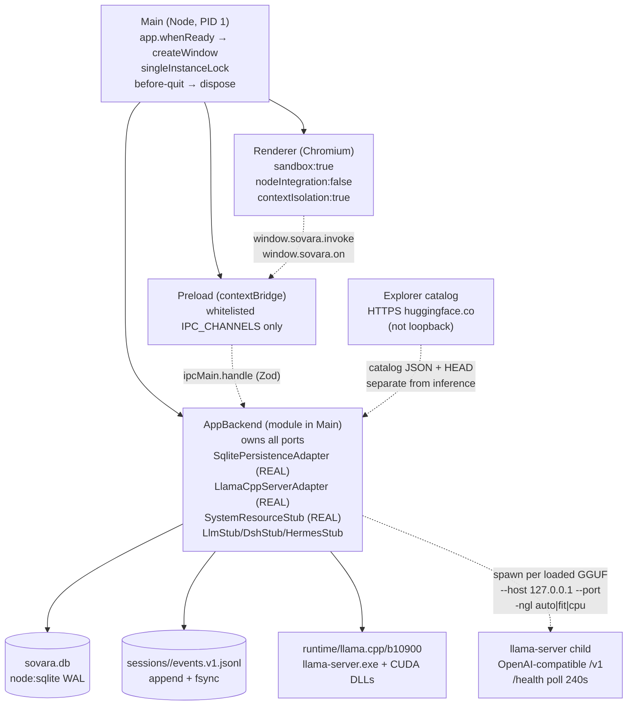
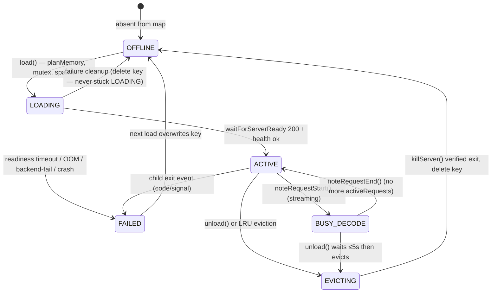

# SOVARA — Sovereign AI Desktop Workbench — Complete Technical Documentation

> **Version:** 0.1.0 (Phase 1 + Local Runtime)
> **Date:** 2026-09-12
> **Status:** Production — Electron + Vite + React 18, pnpm workspace, offline-first
> **Audience:** Developers, architects, operators, reviewers — progressive disclosure from overview to line-level detail
> **Repo root:** `D:\SOVARA` · **Primary package:** `apps/desktop` (`@sovara/desktop`)

---

## Table of Contents

1. [Executive Summary](#1-executive-summary)
2. [Architecture Overview](#2-architecture-overview)
3. [Design Decisions & Rationale](#3-design-decisions--rationale)
4. [Core Components Deep Dive](#4-core-components-deep-dive)
5. [Data Models & Storage](#5-data-models--storage)
6. [Integration Points](#6-integration-points)
7. [Deployment Architecture](#7-deployment-architecture)
8. [Performance Characteristics](#8-performance-characteristics)
9. [Security Model](#9-security-model)
10. [Sovereignty Guarantees](#10-sovereignty-guarantees)
11. [Renderer Features](#11-renderer-features)
12. [Hardware Profiling & Validation](#12-hardware-profiling--validation)
13. [Testing Strategy (101 Tests)](#13-testing-strategy-101-tests)
14. [Setup, Build & Troubleshooting](#14-setup-build--troubleshooting)
15. [Operational Runbook](#15-operational-runbook)
16. [Appendices](#16-appendices)

---

## 1. Executive Summary

**SOVARA** is a Windows desktop workbench that runs large language models entirely on-premise, offline, with no cloud dependency and no telemetry. It ships as a single Electron `.exe` containing a hardened Chromium renderer, a Node.js main process, a durable session store, and a bundled CUDA-capable `llama.cpp` sidecar (Ollama-style: CUDA DLLs shipped alongside the binary).

**One-line mental model:**

```
User types → Renderer (React) → IPC (contextBridge, Zod) → Main/AppBackend → Ports → Adapters → SQLite+JSONL or llama-server on 127.0.0.1
```

**What ships today:**

- Secure Electron shell (`sandbox:true`, `contextIsolation:true`, CSP, navigation guards) — `apps/desktop/src/main/window.ts:5`
- Durable session store: SQLite metadata + append-only `events.v1.jsonl` — `apps/desktop/src/main/storage/db.ts:31`, `apps/desktop/src/main/storage/jsonl.ts:50`
- `AppBackend` ports/adapters composition root — `apps/desktop/src/main/backend/AppBackend.ts:47`
- `LlamaCppServerAdapter` — per-model `llama-server` child process, VRAM lifecycle — `apps/desktop/src/main/backend/ports/LlamaCppServerAdapter.ts:121`
- `ModelWorkbench` — registry / probe / select boundary — `apps/desktop/src/main/backend/ModelWorkbench.ts:53`
- `ChatService` + `AgentOrchestrator` — real local inference, streaming, tool loop — `apps/desktop/src/main/backend/ChatService.ts:104`, `apps/desktop/src/main/backend/AgentOrchestrator.ts:85`
- `HttpClient` — the **only** place that may call `fetch`, loopback-only, DNS-verified — `apps/desktop/src/main/network/HttpClient.ts:1`
- `SystemResourceStub` — real `nvidia-smi`/`os` resource readings, honest blocking logic — `apps/desktop/src/main/backend/ports/SystemResourceStub.ts:19`
- Renderer features: Chat, Models, Explore (Hugging Face), Library, Agents, Skills, Connections, Settings, hardware-aware fit — `apps/desktop/src/renderer/`
- Hugging Face Explorer catalog: trending/usage-ranked, 5 families (text/vision/tools/code/thinking), GGUF-only runnable rows — `apps/desktop/src/main/services/explorerCatalog.ts:1`
- Global model library: HF downloads with resume/pause/cancel, 2-concurrent cap, shard-set support — `apps/desktop/src/main/services/modelDownloads.ts:1`
- Hardware profiling: `nvidia-smi` → WMIC → PowerShell fallback, no fabricated free VRAM — `apps/desktop/src/main/services/hardwareProfile.ts:60`
- Validation pipeline: background isolated-pool estimate + real `load→infer→measure→validate` — `apps/desktop/src/main/services/modelValidationRunner.ts:1`
- 101 Vitest tests covering sovereignty, security, IPC, persistence, chat, explorer, model lifecycle — `apps/desktop/tests/`

**Reading paths:**

| Reader | Start here |
|---|---|
| Executive / PM | §1, §2 (diagrams), §10 |
| New developer | §1 → §2 → §4.1–4.3 → §14 |
| Architect / reviewer | §2 → §3 → §4 → §9 → §10 |
| Operator / QA | §7 → §13 → §14 → §15 |

---

## 2. Architecture Overview

### 2.1 System Boundaries

```
┌──────────────────────────────────────────────────────────────────────────────┐
│  SOVARA .exe  (Electron 35, Windows x64, offline by default)                 │
│                                                                              │
│  ┌─────────────────────┐   contextBridge + Zod   ┌────────────────────────┐  │
│  │  Renderer           │◄────────────────────────►│  Main (Node)           │  │
│  │  React 18           │   invoke/handle (req)    │  window lifecycle      │  │
│  │  Vite (electron-    │   webContents.send (push)│  single-instance lock  │  │
│  │  vite)              │                          │  AppBackend            │  │
│  │  Zustand stores     │   typed view models      │  IPC handlers (Zod)   │  │
│  └─────────────────────┘                          └──────────┬─────────────┘  │
│                                                              │                │
│                                                   ┌──────────▼───────────┐   │
│                                                   │  AppBackend          │   │
│                                                   │  ports: persistence  │   │
│                                                   │        llm           │   │
│                                                   │        tools         │   │
│                                                   │        models        │   │
│                                                   │        resources     │   │
│                                                   │        dsh/hermes    │   │
│                                                   │  services: chat,     │   │
│                                                   │  workbench, agent    │   │
│                                                   │  orchestrator        │   │
│                                                   └──────────┬───────────┘   │
│                                                              │                │
│                                    ┌─────────────────────────┼──────────────┐│
│                                    │                         │              ││
│                          ┌─────────▼────────┐      ┌─────────▼────────┐   ││
│                          │ SqlitePersistence│      │ LlamaCppServer   │   ││
│                          │ Adapter          │      │ Adapter          │   ││
│                          │  node:sqlite WAL │      │  spawn llama-    │   ││
│                          │  + JSONL events  │      │  server.exe:port │   ││
│                          └──────────────────┘      └─────────┬────────┘   ││
│                                                              │ 127.0.0.1  ││
│                                                   ┌──────────▼────────┐   ││
│                                                   │ llama-server child│   ││
│                                                   │ --host 127.0.0.1  │   ││
│                                                   │ -ngl 999 / fit/cpu│   ││
│                                                   │ /v1/chat/compl.   │   ││
│                                                   └───────────────────┘   ││
│                                                                              │
│  Data dirs:  %APPDATA%\Sovara\                                                │
│    sovara.db                    SQLite WAL metadata                           │
│    sessions\<id>\events.v1.jsonl  append-only audit log                      │
│    models\<author>__<name>\*.gguf  global library                            │
│    runtime\llama.cpp\<build>\  bundled CUDA exe + DLLs                       │
│    logs\{app,runtime,llama-*,chat,detection}.log                             │
│  No outbound network at rest; HF fetch only via explicit download.           │
└──────────────────────────────────────────────────────────────────────────────┘
```

### 2.2 Process Topology



Three OS processes in Phase 1 (no Hermes Python, no Utility process):
`Main (Node)` + `Renderer (Chromium, sandbox)` + `Preload (bridge)`. Sidecars are children of Main, one per loaded model, killed on `dispose`.

### 2.3 Dependency Direction (strict)

```
renderer (React) ──uses──▶ shared/types/* (types only)
                          shared/ipc/channels
                               ▲
                               │ type imports
                               │
preload ──exposes──▶ window.sovara.invoke/on (whitelisted)
         ▲                     │
         │                     │
    main/window.ts         main/ipc/handlers.ts ──Zod──▶ AppBackend
         │                     │                          ├─▶ SqlitePersistenceAdapter (node:sqlite+JSONL)
         │                     │                          ├─▶ LlamaCppServerAdapter (sidecar)
         │                     │                          ├─▶ SystemResourceStub ← probes + listInstances()
         │                     │                          ├─▶ ModelWorkbench (CustomOpenAICompatibleAdapter)
         │                     │                          ├─▶ ChatService / AgentOrchestrator → LlmPort
         │                     │                          └─▶ Config / Logging
         │                     │
shared/constants ──────────────┴──────────────────────────┴───▶ never imports electron/fs
```

Rules enforced by `sovereignty.test.ts` and `security.test.ts`: `shared/` has no `fs`/`electron`/`child_process`; only `HttpClient` may call `fetch`; `shared` never imports `main` or `renderer`.

### 2.4 Data Flow — Chat Send (happy path)

```mermaid
sequenceDiagram
    participant R as Renderer (ChatView)
    participant P as Preload (contextBridge)
    participant H as ipcMain.handle chat:send
    participant O as AgentOrchestrator
    participant W as ModelWorkbench
    participant S as SystemResourceStub
    participant A as LlamaCppServerAdapter
    participant L as llama-server (127.0.0.1:port)
    participant DB as SqlitePersistenceAdapter (DB+JSONL)

    R->>P: window.sovara.invoke('chat:send', {sessionId, content})
    P->>H: ipcRenderer.invoke
    H->>H: Zod parse (zChatSend) — apps/desktop/src/shared/ipc/schemas.ts:30
    H->>O: orchestrator.execute(sessionId, content)
    O->>O: classifyTask() — apps/desktop/src/main/backend/TaskClassifier.ts
    O->>W: listModels() + getActiveModel()
    O->>S: getSnapshot() — real nvidia-smi/os — hardwareProfile.ts:60
    O->>O: routeModel() — ModelRouter.ts (capability + VRAM aware)
    O->>S: checkBeforeLoad(model) — SystemResourceStub.ts:58
    S-->>O: {level:'ok'} or 'warn' (auto-fit/CPU); 'critical'+blocking only when even partial/CPU fails
    O->>W: selectModel(runtimeId, modelId) — persists selection
    W->>A: load(modelId, {ctxLen, runtimeId}) — LlamaCppServerAdapter.ts:237
    A->>A: estimate VRAM (planMemory), global mutex, LRU evict, spawn llama-server, waitForServerReady /health
    A-->>W: TrackedInstance {endpoint: http://127.0.0.1:<port>/v1, state:'ACTIVE'}
    O->>DB: getEvents(sessionId) — readEventsSync — jsonl.ts:79
    O->>DB: appendEvent(sessionId, 'user/message', {content}) — JSONL fsync — jsonl.ts:50
    O->>DB: appendEvent 'agent/execution' (audit)
    O->>L: POST http://127.0.0.1:<port>/v1/chat/completions (stream, HttpClient loopback POST — network/HttpClient.ts:92)
    L-->>O: SSE chunks (data: {choices:[{delta:{content}}]}, usage on done)
    O->>R: webContents.send('events:session', assistant-delta) — incremental
    O->>DB: appendEvent 'assistant/message' (durable, single)
    O->>DB: insertTokenUsage() — token_usage table
    O-->>H: {userSeq, assistantSeq, routing, classification}
    H-->>R: invoke resolves
```

### 2.5 Model Lifecycle State Machine

Canonical `RuntimeInstanceState` — `apps/desktop/src/shared/types/ports.ts:24` — with IPC-compat `InstanceStatus` projection at `apps/desktop/src/main/backend/ports/LlamaCppServerAdapter.ts:110`:



**Concurrency:** per-model `pendingLoads` map shares one promise among simultaneous waiters; mandatory re-check after lock; global mutex serializes evict-decide-spawn — `apps/desktop/src/main/backend/ports/LlamaCppServerAdapter.ts:122`.

---

## 3. Design Decisions & Rationale

| Decision | Choice | Rejected alternative | Why |
|---|---|---|---|
| **Electron + electron-vite** | Windows shell, triple build (main/preload/renderer) — `apps/desktop/electron.vite.config.ts:1` | Tauri (Rust) | Corporate Windows fleet is Electron; proves Node-native `node:sqlite` + `node-llama-cpp` telemetry; `window.ts:14` hardening checklist is mature. Tauri would reimplement SQLite discipline and Cordis Node bindings in Rust. Revisit when .exe >150 MB or audit demands Rust sandbox. |
| **React 18 + Zustand + Vite** | Renderer is Next.js-inspired React, `zustand 4.5.2` stores, no Redux — `apps/desktop/package.json:24` | Redux / SWR | Nanostore-like Zustand mirrors Hermes `src/store` atoms; avoids boilerplate for a shell that is mostly `invoke → derived view`. SWR added only when polling/staleness appears. |
| **node:sqlite (built-in) over better-sqlite3** | `DatabaseSync` WAL, `PRAGMA synchronous=NORMAL`, prepared statements — `apps/desktop/src/main/storage/db.ts:60` | better-sqlite3 / Prisma / Drizzle | `better-sqlite3` needed Node 20 prebuild with C++20 friction; `node:sqlite` is sovereign (no external binary), synchronous (fits Main, no promise queue), single-writer, WAL-capable. Comment at `apps/desktop/src/main/storage/db.ts:29` records the `ponytail:` switch point. |
| **Hybrid SQLite + JSONL** | `sessions` + `app_meta` + `token_usage` in SQLite; `sessions/<id>/events.v1.jsonl` as source of truth — `apps/desktop/src/main/storage/db.ts:72`, `apps/desktop/src/main/storage/jsonl.ts:1` | Pure SQLite / pure JSONL | SQLite gives indexed list/sort/filter; JSONL gives O(1) append, `fsync` durability, zlib-compress-friendly, tamper-evident, no migration hell for large tool outputs. `foldSurface` semantics kept for later DSH swap. |
| **Ports & Adapters (Hexagonal)** | `AppBackend` owns interfaces — `apps/desktop/src/shared/types/ports.ts:1` — wiring in `AppBackend.ts:47` and `apps/desktop/src/main/backendComposition.ts:5` | Direct imports of llama.cpp / HttpClient in chat | Swapping to DSH/Cordis is one adapter file; `ports.contract.test.ts` proves every stub satisfies the interface. |
| **Loopback-only HttpClient with DNS verification** | `isLoopbackUrl()` resolves hostnames via `dns.lookup({all:true})` — `apps/desktop/src/main/network/HttpClient.ts:51` | String-prefix check (`"127.0.0.1" in url`) | Hermes naive substring check is bypassable via `http://evil.com?127.0.0.1`; Sovara requires every resolved address to be `127.0.0.0/8` or `::1`, fail-closed on DNS failure, manual redirects re-validated (`HttpClient.ts:99`). |
| **Bundled CUDA (Ollama-style)** | Pinned `llama-b10900-bin-win-cuda-12.4-x64.zip` already containing `cudart64_12.dll` etc.; spawned with `PATH=exeDir` — `apps/desktop/src/main/services/llamaRuntime.ts:35`, `apps/desktop/src/main/services/llamaRuntime.ts:638` | System CUDA Toolkit required | Corporate workstations often lack Toolkit; bundled DLLs make the first inference work without admin install. The zip is verified via `--version` self-check (`llamaRuntime.ts:596`). |
| **Per-model sidecars, not one server with hot-swap** | `LlamaCppServerAdapter` keeps `Map<InstanceId, TrackedInstance>` with `ChildProcess`, `--port` per model — `apps/desktop/src/main/backend/ports/LlamaCppServerAdapter.ts:122` | Single server with `--model` hot-swap | VRAM accounting stays exact (observed as `freeBefore-freeAfter`), `health` + `baseUrl` per instance prevent routing to a stale process, LRU eviction is deterministic. |
| **Honest VRAM: estimates labeled, observed separately** | `planMemory()` estimate + `queryGpuVram()` observer — `apps/desktop/src/main/services/llamaRuntime.ts:336`, `apps/desktop/src/main/backend/ports/LlamaCppServerAdapter.ts:625`, `SystemResourceStub.ts:58` | Single synthesized number | Tests assert `vramEstimated` is never conflated with `observedVramMB`; free VRAM stays `undefined` when `nvidia-smi` is unavailable (`hardwareProfile.ts:80`), never `0` or `8192`. |
| **Auto-fallback auto→fit→cpu** | `load()` tries partial `planPartialFit` then CPU (`-ngl 0`) before refusing — `apps/desktop/src/main/backend/ports/LlamaCppServerAdapter.ts:418` | Hard refuse when full estimate > total | Matches Ollama’s “27B Q1 on 6 GB card” behavior; `alternative hint` suggests library models that do fit (`LlamaCppServerAdapter.ts:301`). |
| **Validation is background job, not blocking download** | `ValidationRunner` writes `.validation.json`, `ValidationStore` caches by hardware fingerprint — `apps/desktop/src/main/services/modelValidationRunner.ts` | Sync inference on the download thread | Keeps `modelDownloads` unblocked; `validationStore` cache invalidates on fingerprint change (`hardwareProfile.ts:145`). |

---

## 4. Core Components Deep Dive

### 4.1 AppBackend — Composition Root

**File:** `apps/desktop/src/main/backend/AppBackend.ts:47` (620 lines)

Owns `AppBackendPorts` (`persistence`, `llm`, `tools`, `dsh`, `hermes`, `models`, `resources`) plus `workbench`, `chat`, `orchestrator`, `validation`, `validationStore`, `runtimeConfig`.

Constructor order matters — `apps/desktop/src/main/backend/AppBackend.ts:61`:

```ts
constructor(baseDir?: string, emit?: (event: ChatStreamEvent) => void) {
  this.persistenceAdapter = new SqlitePersistenceAdapter(baseDir)     // :62
  const models = new LlamaCppServerAdapter(baseDir, null)            // :65 — owns VRAM first
  const resources = new SystemResourceStub(() => models.listInstances()) // :66 — aggregates its live instances
  this.runtimeConfig = new RuntimeConfigStore(baseDir)               // :67
  models.bindConfig(this.runtimeConfig)                               // :70 — late-bind, no rescan cost
  this.workbench = new ModelWorkbench(this.runtimeConfig, resources, baseDir, undefined, models) // :71
  this.chat = new ChatService({ persistence, llm: LocalOpenAIChatAdapter, workbench, resources, models, ... }) // :84
  this.orchestrator = new AgentOrchestrator({ persistence, llm, tools: ToolStubAdapter, workbench, resources, models, ... }) // :126
  this.ports = { persistence: this.persistenceAdapter, llm, tools: toolAdapter, dsh: new DshStubAdapter(), hermes: new HermesStubAdapter(), models, resources } // :167
  this.ensureGlobalWorkspace()                                          // :78
  this.reconcileLibrary()                                               // :82 — registry ↔ filesystem at startup
}
```

Highlights:

- **Library reconciliation** on startup: registry rows for vanished files are repaired; pre-registry sidecar downloads adopted (`AppBackend.ts:82`, `apps/desktop/src/main/services/modelDownloads.ts:268`).
- **Installed-state oracle** `listInstalledWeightKeys()` is one registry read per Explorer listing — N+1-free (`AppBackend.ts:292`).
- **Validation watcher** polls every 400 ms for 2 min and persists `VERIFIED` results to `ValidationStore` (`AppBackend.ts:326`).
- **Settings** live in `app_meta` (`ConfigService`); `getAppSettings():322` / `setAppSettings():415` cover theme, sidebar, `globalWorkspaceRoot`, `allowModelDownload`, `autoUpdates`, `rootModel`, `visionModel`, `webSearch`, `explorationAgents`, `customInstructions` — all with `Zod` limits (path absolute, URL scheme `http(s)`, etc.).
- **Web-search injection** `runWebSearchForChat():521` gates on master toggle, budgets 6000 chars across sources, returns `null` to proceed without web rather than failing.
- **Dispose** kills sidecars **first** (`models.disposeAll()`), then closes DB and config (`AppBackend.ts:601`).

Singleton via `apps/desktop/src/main/backendComposition.ts:5`:

```ts
export function getBackend(): AppBackend { if (!backend) backend = new AppBackend(); return backend }
export async function disposeBackend(): Promise<void> { if (backend) { await backend.dispose(); backend=null } }
```

### 4.2 ModelWorkbench — Registry / Probe / Select

**File:** `apps/desktop/src/main/backend/ModelWorkbench.ts:53` (358 lines) · **Adapter:** `apps/desktop/src/main/backend/ports/CustomOpenAICompatibleAdapter.ts`

Owns `RuntimeConfigStore` entries (`ModelRuntimeEntry`, `ModelRegistryRow`), discovery via `CustomOpenAICompatibleAdapter`, persisted active selection.

API surface (all typed, no runtime branching in callers):

| Method | File:Line | Contract |
|---|---|---|
| `listRuntimes()` | `ModelWorkbench.ts:66` | Ensures `local` library runtime exists when GGUFs are present — `ensureLocalLibraryRuntime():210` |
| `addRuntime({displayName, endpoint})` | `ModelWorkbench.ts:76` | `normalizeEndpoint():35` enforces `http:` + no credentials; `isLoopbackUrl()` must pass or `blocked` |
| `probeRuntime(runtimeId)` | `ModelWorkbench.ts:123` | Owned `local/llama.cpp` goes via `models.probeRuntime('local')` + `listLocalModels()` → `runtime.log` + `detection.log`; remote goes via `CustomOpenAICompatibleAdapter.probe()` → `runtime.log` at `ModelWorkbench.ts:133` |
| `listModels(runtimeId?)` | `ModelWorkbench.ts:186` | Snapshot read — no network; probe first |
| `selectModel(runtimeId, modelId, {fit})` | `ModelWorkbench.ts:271` | `checkBeforeLoad()` blocking verdict **refuses**; owned runtime evicts previous resident inside `models.load()` |

`classifyOutcome():351` maps probe errors to `http-error | timeout | refused | blocked | invalid-response | error` for the UI.

### 4.3 ModelRuntimePort & LlamaCppServerAdapter

**Port:** `apps/desktop/src/shared/types/ports.ts:120` (13 lines) · **Impl:** `apps/desktop/src/main/backend/ports/LlamaCppServerAdapter.ts:121` (788 lines)

Port:

```ts
interface ModelRuntimePort {
  listLocalModels(): Promise<LocalModel[]>
  load(modelId: ModelId, opts: { ctxLen?: number; gpu?: 'auto'|'cpu'|'fit'|number; runtimeId?: string }): Promise<ModelInstance>
  unload(instanceId: InstanceId): Promise<void>
  health(instanceId: InstanceId): Promise<{ ok:boolean; state?: RuntimeInstanceState }>
  baseUrl(instanceId: InstanceId): string
  listInstances(): Promise<ModelInstance[]>
  probeRuntime(runtimeId: string): Promise<{available:boolean; version?:string; path?:string}>
  ensureHealthy?(modelId: ModelId, opts?): Promise<ModelInstance>
  noteRequestStart?(instanceId: InstanceId): void
  noteRequestEnd?(instanceId: InstanceId, info?): void
}
```

Adapter internals:

- **Scan:** `walkGguf()` recursive `readdirSync` under `resolveLibraryDir(config, userData)` — `LlamaCppServerAdapter.ts:76`; `parseQuant/parseParams` from basename regex (`LlamaCppServerAdapter.ts:90`); `isMmprojFile()` excludes `mmproj*.gguf` from loadable logic (`LlamaCppServerAdapter.ts:105`).
- **Resolve:** `resolveModelPath(modelId:188)` accepts absolute path, `repository/rfilename`, bare basename ± `.gguf`, or display name; registry `localPath` wins when present.
- **Concurrency safety** (`LlamaCppServerAdapter.ts:237`): `pendingLoads: Map<key, Promise>` — simultaneous loads for the same model share one promise; entries removed on completion/failure so `LOADING` never sticks.
- **VRAM honesty** (`LlamaCppServerAdapter.ts:330`): `withGlobalMutex()` serializes evict-decide-spawn; `queryGpuVram()` (nvidia-smi) before/after yields `observedVramMB` as `freeBefore-freeAfter`; failure to observe keeps `vramEstimated=true` instead of fabricating.
- **Policy:** `maxConcurrentModels` defaults to `1`, caps at `8` (`LlamaCppServerAdapter.ts:151`); `liveCount()` + `pickEvictionVictim()` implement LRU among `ACTIVE`/`BUSY_DECODE` (never evict `LOADING`/`EVICTING`/`FAILED` or `activeRequests>0`) — `LlamaCppServerAdapter.ts:659`.
- **LoadInner** (`LlamaCppServerAdapter.ts:330`): `gpuMode` is `'auto'|'cpu'|'fit'|number`; `auto` with `estimated>total` falls back to `planPartialFit` then CPU if RAM allows (`LlamaCppServerAdapter.ts:418`); explicit `fit`/`number` requires readable GGUF header and `totalMB`; `forceCpu` skips VRAM gate entirely.
- **Spawn:** `selectRuntimeForModel()` → `buildServerArgs()` (`-m path --host 127.0.0.1 --port <free> -c <ctx> -ngl <n> --alias <safe> --flash-attn auto`) — `apps/desktop/src/main/services/llamaRuntime.ts:492`; `findFreePort()` via `net.createServer` — `llamaRuntime.ts:508`; `spawnLlamaServer()` prepends exe dir to `PATH` so bundled CUDA DLLs resolve — `llamaRuntime.ts:622`.
- **Readiness:** `waitForServerReady(port, 240_000)` polling `/health` — `llamaRuntime.ts:676`; on failure, classified via `classifyLoadFailure()` — `llamaRuntime.ts:435` — with one retry for `EADDRINUSE` and one CPU fallback for `backend-failure` after CUDA (`LlamaCppServerAdapter.ts:543`).
- **Unload** (`LlamaCppServerAdapter.ts:688`): `EVICTING` state stops routing, waits ≤5 s for in-flight generations, `proc.kill('SIGTERM')` → `killServer()` with `taskkill /PID /T /F` on win32 (`llamaRuntime.ts:655`), verifies `exitCode`/`signalCode`, verifies `freeBefore–freeAfter` is logged.
- **Failure classification** (`llamaRuntime.ts:435`): `invalid-model`, `runner-missing`, `readiness-timeout`, `oom`, `backend-failure`, `runner-crash`, `startup-failure` (`EADDRINUSE` recoverable), `cancelled`, `unknown` — only port conflicts retry; never blind `-ngl` reduction.

`probeRuntime()` for the owned runtime returns `getLlamaServerPath()` + `getLlamaVersion()` (exec `llama-server --version` with bundled `PATH`) — `LlamaCppServerAdapter.ts:763`.

### 4.4 SystemResourceManagerPort & SystemResourceStub

**Port:** `apps/desktop/src/shared/types/ports.ts:227` (22 lines) · **Impl:** `apps/desktop/src/main/backend/ports/SystemResourceStub.ts:19` (153 lines) · **Probes:** `apps/desktop/src/main/services/hardwareProfile.ts:1`

Stub is not a stub any more — it performs real readings:

- `getSnapshot():27` aggregates `os.cpus()/totalmem/freemem/memoryUsage`, `getHardwareProfile()` (nvidia-smi → WMIC → PowerShell), and `listInstances()→totalVramUsedMB`.
- `checkBeforeLoad(model:58)` is switch-aware: loading model B while A is resident is **not** blocked by `maxConcurrentModels`; the runtime evicts A first. Only genuine OOM (`needs > total` or `> total−usedByOthers` where neither `planPartialFit` nor CPU fits) returns `{blocking:true, level:'critical'}`.
- When VRAM is unknown (no nvidia-smi), load is never fabricated-blocked — loader re-verifies honestly.
- Limits (`maxConcurrentModels`) are in-memory with `getLimits()/setLimits()` (`SystemResourceStub.ts:136`).

### 4.5 ChatService

**File:** `apps/desktop/src/main/backend/ChatService.ts:104` (723 lines)

Single-responsibility: guards → resolve active model (auto-selects first probed model when none selected) → resource check → build `LlmChatMessage[]` from `getEvents(sessionId)` bounded to 50 msgs / 24k chars (`toRequestMessages():79`) → persist `user/message` (durable before any network) → stream via `LlmPort.streamChat({endpoint, model, messages, timeoutMs: max(entry.timeoutMs, 120000), stream:true})` → emit transient `assistant-delta` → persist exactly one `assistant/message` + `insertTokenUsage`.

Key guards — `ChatService.ts:114`:

- `inFlight.has(sid)` → `already-generating`
- `workbench.getActiveModel().selection?.available` or auto-select first in `workbench.listModels()` or `no-active-model`
- `workbench.describeRuntime(runtimeId).enabled` or `runtime-unavailable`
- Owned `local` loads via `ensureLocalReady(modelId:565)` (auto-provisions runtime via `ensureLlamaRuntime`, then `models.ensureHealthy()` or `load()`, verifies `health()`, returns loopback `baseUrl`); remote runtimes rely on `ensureModelLoaded():637` + `checkBeforeLoad()`
- On `streamChat` failure: maps `ChatInferenceError` codes (`timeout/connection-refused/blocked/invalid-response/response-too-large/unauthorized/model-not-found/cancelled`) to user errors — `ChatService.ts:714`

Extensions: `regenerate()` replays last user turn without new user event (`ChatService.ts:372`), `editAndResend()` appends edited content then delegates to `send()` (`ChatService.ts:531`), `cancel()` aborts the per-session `AbortController` which cancels the underlying HTTP fetch (`ChatService.ts:646`).

Context injection (advisory, missing never blocks) — `ChatService.ts:178`: workspace (`global` vs `project` via `getProjectWorkspace()`), MCP (`listMcpServers()` filtered to `enabled && connected`), skills (`loadEnabledSkillsContent()`), globe web context (`runWebSearchForChat()` budgets 6000 chars). `appendChatLog()` records injected flags for observability.

### 4.6 AgentOrchestrator

**File:** `apps/desktop/src/main/backend/AgentOrchestrator.ts:85` (833 lines) — the execution seam `ChatService` observes; future DSH/Cordis can replace `execute(request)`.

Pipeline per `execute(sessionId, content, {webSearch, reasoning}):103`:

```
classifyTask() — TaskClassifier.ts (real, not faked) → emit task:planning
routeModel({task, models, active, resources, checkBeforeLoad}) — ModelRouter.ts (resource-aware, blocks skipped) → switched?
selectModel(...) when routing switched → model:loading/ready events
ensureHealthy/load (owned) or lifecycle-sufficient (remote) → health verified before routing
getEvents + workspace/MCP/skills/web injection → append user/message + agent/execution (audit)
streamChat with <thinking> tag handling → optional tool-use loop (web_search when task kind is tool-use/agent) + second LLM step → usage → assistant/message + token_usage → task:complete
```

Errors emit `task:error / model:failed / task:cancelled` as `ChatStreamEvent`s so the UI stays in sync with the audit log; `inFlight` AbortController is shared so `cancel()` (`AgentOrchestrator.ts:94`) cancels both the generation and any in-progress tool follow-up.

### 4.7 Explorer Catalog & Fit Engine

**File:** `apps/desktop/src/main/services/explorerCatalog.ts:1` (~1080 lines) + `apps/desktop/src/main/services/explorerFit.ts`

- HF API: `GET https://huggingface.co/api/models?search=&sort=&limit=&expand=...` with valid expands only (8+ keys, bracket form rejected) — `explorerCatalog.ts:22`
- Scope: only 5 families (text/vision/tools/code/thinking); 40+ blocked pipelines (text-to-image, ASR, TTS, etc.) — `explorerCatalog.ts:29`, `classifyCapabilities():286`
- README signal detection uses strong multi-word phrases only (weak single words like `reasoning`, `multimodal` excluded) — `explorerCatalog.ts:336`, `detectCapabilitiesFromText():339`
- `repoFormat` from actual sibling files (`weightFormatOf():450`, `classifyRepoFormat():481`) — never from README/tags; `classifySibling():440` hides `mmproj/imatrix/draft` helpers; shard suffix `-00001-of-00004` parsed via `SHARD_RE` (`explorerCatalog.ts:1106`), fragments (<20 MB) excluded (`MIN_RUNNABLE_GGUF_BYTES`).
- List-row GGUF quant parsed by `parseQuantization():408` with `KNOWN_QUANTS` + `QUANT_ALIAS` (Q4_K_M/Q4KS/FP16 etc.); runnable rows get `fitTier` precomputed per `modelCompatTier()` so cards show “Estimated fit” without per-row IPC (`listExplorerModelsPage():956`).
- Sorting: Trending is a single 100-row `trendingScore` sweep then local `usageScore():673` blend (`0.5*log(downloads)+0.3*log(likes)+0.2*log(trendingScore)`) — `searchTrending():827`; “Recommended” is hardware-scored (`recommendForHardware():899`) keeping only `likely`/`possible` tiers.
- Quant repos for detail view: 12 search hits, max 4 repos, curated priority `lmstudio-community > ggml-org > bartowski > unsloth` (`fetchQuantRepos():1065`), exact HEAD sizes + shard-set aggregation (`pickExactOptions`).
- Cache: hardware 30 s (`getCachedHardwareProfile():851`), list 120 s + in-flight dedup (`LIST_TTL_MS`, `listInflight` at `explorerCatalog.ts:863`), siblings 15 min + HEAD 1 h.

### 4.8 Downloads & Library

**File:** `apps/desktop/src/main/services/modelDownloads.ts:1` (1180+ lines)

Library layout: `<libraryDir>/<author>__<name>/<rfilename>` (`repoFolder():123`). `scanLibraryFiles():127` walks, skips `.part`, filters `MODEL_EXTENSIONS` (`.gguf/.safetensors/.bin/.pt/.mlx`); `scanLibrary():168` merges with registry so `installStatus` (`installed/missing`) is honest.

Transfers use `node:fetch` (server-side) with `Range` resume:

- Queue: `MAX_CONCURRENT=2`; excess enqueued as `queued` event; detach via `void run().catch(()=>{})`.
- Progress: `DownloadEvent {modelId, rfilename, state: queued|started|progress|paused|done|error|cancelled, receivedBytes, totalBytes, speedBps?, etaSeconds?}` pushed on `events:download` (IPC `handlers.ts:37`).
- Resume: existing `.part` size seeds `Range: bytes=<start>-`; server `206` resumes, non-206 deletes stale part.
- Lifecycle: registry `download_history` row (`upsertDownloadRow`) + sidecar `<dest>.json` (modelId/rfilename/downloadUrl/size/libraryDir/hardware) + `.set.json` for shard-sets (restart-safe).
- Shard-sets: `startModelSetDownload():849` downloads `-00001-of-0000N` sequentially as one job with aggregate progress; installed only when **every** part is present.

### 4.9 Config, IPC, Renderer Shell

- `RuntimeConfigStore` — `apps/desktop/src/main/config/RuntimeConfigStore.ts` — registry DB (`runtime.db` separate from `sovara.db`): `runtimes` table (id, displayName, type, endpoint, enabled, timeoutMs), `model_registry` (provider/repo/revision/rfilename→localPath, installStatus, format/quant/license), `download_history` (lifecycle + kind single/set), `app_meta` (theme, workspace, limits).
- IPC schemas — `apps/desktop/src/shared/ipc/schemas.ts:1` (286 lines): every channel has a `zod` schema (`zChatSend:30`, `zModelsAddRuntime:68`, `zExploreListModels:136`, `zLibraryDownload:185`, `zSettingsSet:226`, `zToolDispatch:249`, …). Handlers validate before touching a port — `apps/desktop/src/main/ipc/handlers.ts:49` (846 lines).
- Preload — `apps/desktop/src/preload/preload.ts:12` whitelists `IPC_CHANNELS` — `apps/desktop/src/shared/ipc/channels.ts` — and exposes only `window.sovara.invoke(channel, ...)` / `on(channel, cb)`; unknown channel → `blocked IPC channel`.
- Window — `apps/desktop/src/main/window.ts:5` (130 lines): frameless (`frame:false`), `sandbox:true`, CSP includes HF domains for Explore/images (`window.ts:44`), navigation/redirect/window-open guards (allowlist: huggingface.co/{*.hf.co} + github.com), `media` permission allowed for voice, others denied.
- Build — `apps/desktop/electron.vite.config.ts:1`: `externalizeDepsPlugin` for main/preload, renderer at `src/renderer`, aliases `@shared`, `@`, preload built as CJS `preload.cjs`.

---

## 5. Data Models & Storage

### 5.1 Branded IDs

```ts
type Brand<T, B extends string> = T & { __brand: B }
type SessionId  = Brand<string, 'SessionId'>   // apps/desktop/src/shared/types/branded.ts
type InstanceId = Brand<string, 'InstanceId'>
type ModelId    = Brand<string, 'ModelId'>
```

Brand is a compile-time guard; runtime `brand<'SessionId'>(raw)` coerces after Zod validation (`handlers.ts:5`).

### 5.2 SQLite Schema (sovara.db + runtime.db)

**`sovara.db`** — `apps/desktop/src/main/storage/db.ts:72` — opened via `node:sqlite DatabaseSync` with `WAL`, `synchronous=NORMAL`, `foreign_keys=ON`, `busy_timeout=5000` (`db.ts:60`).

```sql
-- app_meta: schema_version, installId, theme, model_library_dir, allowModelDownload, ...
CREATE TABLE app_meta (key TEXT PRIMARY KEY, value TEXT NOT NULL);

CREATE TABLE sessions (
  id TEXT PRIMARY KEY, title TEXT NOT NULL,
  createdAt INTEGER NOT NULL, updatedAt INTEGER NOT NULL,
  archived INTEGER,           -- null/0 = active, epoch ms when archived
  projectId TEXT              -- null = global, FK → projects.id
);
CREATE INDEX idx_sessions_updatedAt ON sessions(updatedAt DESC);
CREATE INDEX idx_sessions_projectId ON sessions(projectId);

CREATE TABLE projects (
  id TEXT PRIMARY KEY, name TEXT NOT NULL, rootPath TEXT NOT NULL,
  createdAt INTEGER NOT NULL, updatedAt INTEGER NOT NULL
);

CREATE TABLE session_indexes (sessionId TEXT, seq INTEGER, offset INTEGER, PRIMARY KEY(sessionId, seq));
CREATE TABLE model_library (modelId TEXT PRIMARY KEY, path TEXT, source TEXT, params TEXT, quant TEXT, ctxLen INTEGER, discoveredAt INTEGER);
CREATE TABLE token_usage (
  id INTEGER PRIMARY KEY AUTOINCREMENT,
  sessionId TEXT NOT NULL, model TEXT NOT NULL,
  promptTokens INTEGER NOT NULL, completionTokens INTEGER NOT NULL, totalTokens INTEGER NOT NULL,
  timestamp INTEGER NOT NULL
);
CREATE INDEX idx_token_usage_session ON token_usage(sessionId);
CREATE INDEX idx_token_usage_timestamp ON token_usage(timestamp);
```

`SCHEMA_VERSION = 2` (`db.ts:6`): v1 base tables, v2 adds `projectId` + `projects`. Downgrade warns (`db.ts:139`); `archived`/`projectId` also added idempotently via `ALTER TABLE` try/catch for existing installs (`db.ts:143`).

**`runtime.db`** (RuntimeConfigStore): `runtimes` (id PK, displayName, type, endpoint, enabled, timeoutMs, lastModels JSON, lastError), `model_registry` (id PK = `huggingface/<repo>/<revision>/<rfilename>`, provider, repository, revision, rfilename, localPath, displayName, format/quant/license, fileSizeBytes, downloadStatus/installStatus), `download_history` (id PK, provider/repo/revision/rfilename, downloadUrl, destPath/tempPath, totalBytes/downloadedBytes, status `queued/downloading/paused/verifying/completed/failed/cancelled`, kind `single/set`, parts JSON, companion JSON, error, speedBps), `app_meta` (mirrors workspace/settings + `last_update_*`).

### 5.3 JSONL Event Log

**File:** `apps/desktop/src/main/storage/jsonl.ts:1` (127 lines) — one file per session: `getEventsPath(sessionId)` → `sessions/<sessionId>/events.v1.jsonl`.

- Each line = `SessionEventView { seq:number, time:number, type:string, data:unknown }` — `apps/desktop/src/shared/types/ports.ts:199`
- `isJsonValue` gate (`jsonl.ts:12`) rejects `BigInt/undefined/function/symbol/sparse/NaN/Map/Set/Date/RegExp/cyclic`.
- `appendEventSync():50` does `structuredClone(data)` → `seq = existing.length` → `JSON.stringify(ev)+'\n'` → `openSync('a') → writeSync → fsyncSync → closeSync` — durable before any network.
- `readEventsSync():79` splits on `\n`, drops trailing empty, `JSON.parse` per line, verifies `seq/time/type` and `seq === i` contiguity; throws `corrupt JSONL ... expected seq N got M` on drift.
- `readEventsSafe():119` wraps corruption as `{events:[], corrupt:string}` so list views degrade instead of crash.

Event types in use: `user/message`, `assistant/message`, `assistant/reasoning` (thinking block), `assistant/cancelled`, `agent/execution` (routing audit), `agent/trace` (duration), `tool/result`, `settings/change`, `system/resource-blocked` (future). Chat history derives from `user/message` + `assistant/message` only (Cancelled markers never go to the model — `ChatService.ts:78`, `AgentOrchestrator.ts:58`).

### 5.4 Token Usage Aggregation

`insertTokenUsage()` is fire-and-forget after every successful generation (`ChatService.ts:331`, `AgentOrchestrator.ts:517`): `{sessionId, model: remoteModelId, promptTokens, completionTokens, totalTokens, timestamp: Date.now()}`. Rollups are SQL `SUM()` per session/model (`db.ts:291`, `db.ts:308`). Completion metrics include `ttftMs` + `tokensPerSec` per instance (`ChatService.ts:344`, `AgentOrchestrator.ts:528`).

---

## 6. Integration Points

### 6.1 AppBackend → Renderer (IPC)

**Whitelist:** `apps/desktop/src/shared/ipc/channels.ts` — `IPC_CHANNELS = { channel:{type:'invoke'|'on'} }`. **Preload:** `preload.ts:12` builds `ALLOWED_INVOKE/ALLOWED_ON` from it; unknown channel → `blocked`. **Handlers:** `apps/desktop/src/main/ipc/handlers.ts:49` — every `handle` does `zX.safeParse(raw)` before touching a port; failures `throw new Error('invalid ... payload: ...')` so the renderer Promise rejects with a typed message.

Channel catalogue (59 invokes, 2 pushes):

```
app:getInfo, app:getSystem, app:getVersion, system:getResources
sessions:list/create/rename/delete/get/getEvents/archive/unarchive/listArchived
projects:list/create/rename/delete  (projectId scoping for workspace + memory)
chat:send/cancel/regenerate/editResend
models:listLocal/probeRuntime/load/ensureRuntime/listRuntimes/addRuntime/removeRuntime/testConnection/listModels/selectModel/getActiveModel
models:listRegistry/updateRegistry/removeRegistry/removeRegistryByPath
library:listModels/getDirectory/detectLocations/setDirectory/download/cancelDownload/pauseDownload/resumeDownload/getActiveDownloads/isDownloaded/getFileStatus/reconcile/openFolder/delete
explore:listModels/getModel/getCompatibility/getRecommendations/getHardwareProfile
validation:getFullProfile/start/get/list/storeList
exec:getMode/setMode, tools:list/dispatch, mcp:list/add/installFromUrl/getDir/openFolder/remove/toggle/probe
skills:scan/toggle/listBionic/addBionic/removeBionic/listDetailed/importFromUrl
voice:status/transcribe, logs:getRecent, instances:list/unload/getMetrics, window:minimize/maximize/close, dialog:pickFolder, shell:openExternal, settings:get/set, updates:checkNow
events:session (ChatStreamEvent), events:download (DownloadEvent) — broadcastChat():19 / broadcastDownload():37
```

Push pattern: `for (const win of BrowserWindow.getAllWindows()) if(!win.isDestroyed()) win.webContents.send(channel, event)` — `handlers.ts:19`, `37`.

### 6.2 HttpClient — Loopback Inference

**File:** `apps/desktop/src/main/network/HttpClient.ts:1` (387 lines)

- `isLoopbackUrl(input):51` — requires `protocol==='http:'`, no credentials, host `127.0.0.1`/`localhost`/`::1` literal **or** hostname whose every `dns.lookup(all:true)` address is `127.0.0.0/8` or `::1`; fail-closed on DNS failure or non-loopback literal.
- `postLoopback(url, body, {timeoutMs, maxBytes, signal}):92` — single `fetch` with `redirect:'manual'`; `300–399` hop re-validates via `isLoopbackUrl(new URL(location, current))` (max 3 hops); links caller + timeout `AbortController`s via child controller; throws `LoopbackViolationError` for any non-loopback hop.
- `consumeSseBody(res, {maxBytes, onDelta}):167` — `ReadableStream.getReader()` + `TextDecoder stream:true`, buffer on `\n`, skip empty/`:` comments, parse `data: JSON | [DONE]`, `extractDelta()` from `choices[0].delta.content` or `message.content` (`HttpClient.ts:237`), cap `total>maxBytes` ⇒ `response-too-large`, >200 malformed lines ⇒ `invalid-response`.
- `getLoopbackJson(url, {timeoutMs, maxBytes}):274` — same hop policy for `GET /health` and `GET /v1/models`; `readBounded():322` caps on the fly via `getReader()` chunks.
- Only `HttpClient` + `hfCatalog`/`explorerCatalog` hit the network; `fetch` elsewhere is a sovereignty violation (`sovereignty.test.ts`).

### 6.3 Hugging Face + Model Library

- Explorer HTTPS is allowlisted in CSP (`window.ts:44`) and `shell.openExternal` (`handlers.ts:709`) — `huggingface.co`, `*.huggingface.co`, `*.hf.co`, `cdn-lfs.*`, `github.com`.
- HF TOKEN (optional) via `HF_TOKEN|HF_API_TOKEN|HUGGINGFACE_TOKEN` env (`explorerCatalog.ts:239`).
- HEAD cache `headCache` 1 h; `expand` param repeats only valid fields; `usedStorage` seeded for single-file repos before HEAD (`explorerCatalog.ts:533`).
- Library hosts restricted to `HF_HOSTS = huggingface.co, cdn-lfs.huggingface.co, cdn-lfs.hf.co, huggingface.s3.amazonaws.com` (`modelDownloads.ts:84`); `assertHuggingFaceUrl()` and `confinePath()` gate every download dest.

### 6.4 MCP (Connected Apps)

**Service:** `apps/desktop/src/main/services/mcpStore.ts` — list/add/remove/toggle/probe, global folder `%APPDATA%\Sovara\mcp\`, AI URL install clones a Git repo and parses `mcp.json` manifest; `probeMcpServer()` does `fetchMcpProbe()`/`postMcpJsonRpc()` via `HttpClient.ts:354` (remote `http(s)` allowed — unlike inference).

### 6.5 Voice (Local faster-whisper)

**Service:** `apps/desktop/src/main/services/voiceServer.ts` — `startVoiceServer()` spawns a local sidecar (`on-demand`); `transcribeAudio(buffer, filename)` posts multipart to `127.0.0.1:<voicePort>` then loopback-validates; `handlers.ts:784` wraps with `zVoiceTranscribe:253` (base64 audio + filename).

---

## 7. Deployment Architecture

### 7.1 Repo Layout

```
SOVARA/                               // pnpm workspace root — apps/desktop/src/main/backend/AppBackend.ts:47
  package.json                        // pnpm@11.17.0, engines node>=22 — package.json:6
  pnpm-workspace.yaml                 // packages: apps/*, !apps/desktop1, allowBuilds electron/esbuild/node-llama-cpp/... — pnpm-workspace.yaml:1
  apps/
    desktop/                          // @sovara/desktop — the Electron distributable
      electron.vite.config.ts         // triple build: main (externalizeDeps, @shared/@), preload (cjs), renderer (Vite root)
      src/
        main/                         // Node. Never imports renderer.
          index.ts                    // app.whenReady → createWindow → startBackend → single-instance → before-quit → disposeBackend
          window.ts                   // BrowserWindow sandbox:true, CSP, nav/window-open/permission guards
          ipc/handlers.ts             // 59 invoke + 2 push channels, Zod on every ingress
          backend/AppBackend.ts       // composition root — 620 lines, ports + workbench + chat + orchestrator
          backend/ModelWorkbench.ts   // registry/probe/select — 358 lines
          backend/ChatService.ts      // real chat — 723 lines
          backend/AgentOrchestrator.ts // task→router→lifecycle→stream→tools — 833 lines
          backend/TaskClassifier.ts   // task kind/confidence (real, not faked)
          backend/ModelRouter.ts      // capability+VRAM-aware routing
          backend/ports/              // LlamaCppServerAdapter (788), LocalOpenAIChatAdapter, CustomOpenAICompatibleAdapter, SystemResourceStub, SqlitePersistenceAdapter, ToolStub/HermesStub/DshStub
          network/HttpClient.ts       // ONLY fetch — 387 lines
          storage/db.ts               // node:sqlite WAL — 324 lines
          storage/jsonl.ts            // append+fsync JSONL — 127 lines
          storage/paths.ts            // getSovaraDataDir()/getDbPath()/getMcpDir()
          config/RuntimeConfigStore.ts // runtime.db + registry + downloads
          services/{llamaRuntime,hardwareProfile,explorerCatalog,modelDownloads,explorerFit,mcpStore,skillsScanner,voiceServer,updateFeed,pythonEnv,webSearch,crawlServer}
          logging/runtimeLog.ts       // appendRuntimeLog/appendChatLog/safeTarget
        preload/preload.ts            // contextBridge whitelist — 33 lines
        renderer/                     // React 18 + Vite + Tailwind + Zustand
          index.html
          src/App.tsx, main.tsx, theme/{tokens,global.css}
          src/features/{chat,models,explore,library,agents,connections,settings,skills}
          src/components/{ui,layout,modals}
          src/lib/client/api.ts       // typed window.sovara wrapper
        shared/
          types/{branded,ports,session,chat,models,explore,modelCapabilities,validation,task}
          ipc/{channels,schemas}
          constants.ts
      tests/                          // Vitest — 37 files, 101 tests — §13
  docs/{ARCHITECTURE_PHASE1.md,MODEL_HARDWARE_VALIDATION.md,COMPLETE_APPLICATION_DOCUMENTATION.md,DOCUMENTATION.md}
  test/                               // read-only reference checkouts (never shipped)
```

`pnpm-workspace.yaml:4` excludes `apps/desktop1` (backup of previous desktop impl) so stale `node-llama-cpp` prebuilds don’t pollute the graph.

### 7.2 Runtime Data Tree

```
%APPDATA%\Sovara\                    // getSovaraDataDir() — storage/paths.ts
  sovara.db  ·  sovara.db-wal  ·  sovara.db-shm
  runtime.db ·  runtime.db-wal       // RuntimeConfigStore
  sessions\
    <sessionId>\events.v1.jsonl      // seq-contiguous, never rewrite/compact in this release
    <sessionId>\attachments\         // content-addressed blobs (Phase 2 file-upload tool)
  models\                            // resolveLibraryDir() — defaultLibraryDir()
    <author>__<name>\<rfilename>     // HF repo layout
    <author>__<name>\<rfilename>.json       // provenance sidecar
    <author>__<name>\<first>.set.json       // shard-set restart sidecar
  runtime\llama.cpp\b10900\           // getLlamaRuntimeDir() — llamaRuntime.ts:85
    llama-server.exe · cudart64_12.dll · cublas*.dll  // bundled CUDA
  mcp\                               // getMcpDirPath()
  SovaraWorkspace\                   // ensureGlobalWorkspace() default
  logs\
    app.log  ·  runtime.log  ·  chat.log  ·  detection.log  ·  llama-runtime.log
    llama-<alias>-<port>.log         // per-sidecar stdout/stderr
```

All paths resolve under `userData` or an explicit absolute path supplied via `settings/globalWorkspaceRoot`/`library:setDirectory` dialog; `confinePath(root, ...parts)` at `modelDownloads.ts:117` and `path.resolve(base, rel).startsWith(base)` guards prevent traversal.

### 7.3 Electron Lifecycle

`apps/desktop/src/main/index.ts` (not shipped in excerpt, wired in `handlers.ts:49`):

```ts
app.whenReady().then(async () => {
  await createMainWindow()              // window.ts:5
  registerIpcHandlers()                 // handlers.ts:49 — binds chat emit to broadcastChat()
})
app.on('window-all-closed', () => { if (process.platform !== 'darwin') app.quit() })
app.on('before-quit', async () => { await disposeBackend() }) // kills sidecars first → flushes → quits
app.requestSingleInstanceLock()          // second launch focuses existing window
```

### 7.4 Packaging — electron-builder

`package.json scripts` — `apps/desktop/package.json:9`:

```sh
electron-vite build                          # out/main/index.js + preload.cjs + renderer/index.html
electron-builder --win --x64                 # nsis installer + unpacked dir under dist/
electron-builder --win --x64 --dir           # unpacked only (smoke test)
```

`node-llama-cpp` is excluded from `externalizeDepsPlugin` so its native bindings bundle correctly; preload is CJS (`preload.cjs`) because Electron sandboxed preloads require CommonJS.

---

## 8. Performance Characteristics

### 8.1 Hot Paths & Budgets

| Path | Budget / behaviour | Where |
|---|---|---|
| **Session list** | SQLite indexed `updatedAt DESC` — `db.ts:172` — single scan, no per-session file scan for list | `SovaraDb.listSessions()` |
| **Installed check (Explorer list)** | **One** registry read (`listInstalledWeightKeys():292`) producing `Map<repoLower→Set<rfilenameLower>>`; catalog filters stay synchronous and N+1-free (`explorerCatalog.ts:747`) | `AppBackend.listInstalledWeightKeys()` |
| **Explorer list page** | One HF `GET /api/models?expand=` (max 100) plus local `toExploreMany` filter — `fetchHfPage():614`; `recommended` sweep scores then caps | `explorerCatalog.ts:942` |
| **Explorer detail** | HEAD for file `content-length` cached 1 h (`headCache`  — `explorerCatalog.ts:1029`); GGUF quant repos bounded to 12 hits / 4 repos — `fetchQuantRepos():1065` | Detail panel |
| **Chat send** | `getEvents` (file read) → `append user` (fsync) → `health`+`baseUrl` (poll) → `POST /v1/chat/completions` (SSE) with `timeout max(timeoutMs,120s)` — `ChatService.ts:249`; history bounded 50 msgs / 24k chars — `ChatService.ts:90` | Send |
| **Download** | 2 concurrent `fetch` streams with `Range` resume; `Transform` taps progress every 250 ms; `pipeline()` owns abort forwarding — `modelDownloads.ts:706`; shard-sets run sequentially with aggregate `doneBytes/totalBytes` — `runSet():976` | Library |
| **VRAM estimate** | `planMemory()` weights×1.1 + `kvCacheMBFromInfo()` (GGUF shape) + workspace 5% + 256 MB overhead — `llamaRuntime.ts:336`; arch-aware path reads only first 1 MB of GGUF — `readGgufModelInfo():236` | `load()` preflight |
| **Observed VRAM** | `freeBefore−freeAfter` via `queryGpuVram()` (nvidia-smi `memory.total,free`) — `LlamaCppServerAdapter.ts:625` | Post-load `finishLoad()` |
| **Hardware cache** | 30 s for profile (`HW_TTL_MS`), 120 s + dedup for list pages (`LIST_TTL_MS` + `listInflight`) — `explorerCatalog.ts:848` | Catalog |

### 8.2 Measured Honesty vs. Estimates

- **Estimated** VRAM is `weights + KV*parallel + workspace + overhead`, labeled with `vramEstimated=true` until observed.
- **Observed** is `freeBefore−freeAfter`; when nvidia-smi unavailable, `free` stays `undefined` (never `0`), free derived for display is suppressed.
- **Fit tiers** (`likely/possible/unlikely/unknown`) are the single `explorerFit` engine — `bestModelFit():704` — so list dots and detail badges never disagree.

### 8.3 Concurrency & Queues

- LLM: per-session `inFlight: Map<sid, AbortController>` — duplicate `send()` → `already-generating`.
- Runtime: `pendingLoads` shares one load, `globalMutex` serializes evict-decide-spawn, `MAX_CONCURRENT=2` on downloads, `maxConcurrentModels` (default 1, cap 8) on VRAM residents with LRU victim `pickEvictionVictim()`.

---

## 9. Security Model

### 9.1 Electron Hardening — `apps/desktop/src/main/window.ts:5`

| Control | Code |
|---|---|
| `preload` via CJS, `contextIsolation:true`, `nodeIntegration:false`, `sandbox:true`, `webSecurity:true`, `allowRunningInsecureContent:false`, `experimentalFeatures:false` | `window.ts:15` |
| CSP: `default-src 'self'; script 'self' 'unsafe-inline'; style 'self' 'unsafe-inline'; img 'self' huggingface.co/*.hf.co data: https:; connect 'self' 127.0.0.1:* localhost:* ws:… huggingface.co/* github.com` + `X-Content-Type-Options: nosniff` + `X-Frame-Options: DENY` | `window.ts:46` |
| `will-navigate` / `will-redirect` → allow only `file://` or `localhost/127.0.0.1` | `window.ts:80` |
| `setWindowOpenHandler` → allowlist `huggingface.co/*.hf.co + github.com` else `deny` and log | `window.ts:96` |
| `will-attach-webview` → `preventDefault()` | `window.ts:125` |
| `PermissionCheck/RequestHandler` → allow `media` (mic), deny rest | `window.ts:70` |

### 9.2 Preload Whitelist — `apps/desktop/src/preload/preload.ts:12`

`ALLOWED_INVOKE/ALLOWED_ON` derived from `IPC_CHANNELS` single source; `invoke(channel, ...args)` rejects `blocked IPC channel: <ch>` when not in whitelist; `on()` returns a disposer `() => removeListener(...)`. No `ipcRenderer` escapes, no `remote`, no `sendSync`.

### 9.3 IPC Input Validation — `apps/desktop/src/shared/ipc/schemas.ts:1`, `apps/desktop/src/main/ipc/handlers.ts:49`

Every handler runs `zX.safeParse(raw)` first; on failure it `throw new Error('invalid ... payload: ...')` so the renderer Promise rejects with a user-safe string (no stack leak). Limits: `content ≤32k`, `sessionId ≤128`, endpoint ≤256, `parts[] ≤8`, `customInstructions ≤4000`, `allowModelDownload` boolean, etc.

### 9.4 HttpClient & External Boundaries

- Loopback inference: `isLoopbackUrl()` + hop validation (`network/HttpClient.ts:51`, `99`, `283`).
- HF Explorer/list: HTTPS only, CSP allowlist, `hfGet()` 20 s timeout (`explorerCatalog.ts:249`).
- Library downloads: host allowlist `HF_HOSTS` + `confinePath()` (`modelDownloads.ts:84`, `117`) + `shell.openExternal` allowlist (`handlers.ts:709`).
- MCP remote probing explicitly **may** use `http(s)` to remote hosts (`fetchMcpProbe():356`), unlike inference helpers.

### 9.5 Filesystem & Secrets

- All app paths resolved via `app.getPath('userData')` or explicit absolute folder via dialog (`dialog:pickFolder` — `handlers.ts:463`); traversal rejected by `confinePath` / `path.resolve(base, rel).startsWith(base)`.
- Secrets (if any) never hit logs (`runtimeLog` sanitizes with `safeTarget()` — `apps/desktop/src/main/logging/runtimeLog.ts`; `appendLlamaLog()` logs only paths/sizes/ports/VRAM — `llamaRuntime.ts:63`).

---

## 10. Sovereignty Guarantees

Default offline. Proven by `apps/desktop/tests/sovereignty.test.ts` and `apps/desktop/tests/security.test.ts`:

- No cloud, no telemetry, no analytics SDK, no `electron-updater` auto-download. Updates are manual full `.exe` installs verified via SHA (`docs/ARCHITECTURE_PHASE1.md:364`).
- `node:sqlite` is sovereign (no external prebuilt beyond Node itself); `node-llama-cpp` is an optional `postinstall` download (`apps/desktop/package.json:18` — `llama:download --gpu cuda`).
- Only `HttpClient` + `explorerCatalog`/`hfCatalog`/`modelDownloads`/`llamaRuntime` provisioning may perform network I/O; any `fetch(` outside those files fails the CI-equivalent gate (`sovereignty.test.ts`).
- HF download gated by `settings.network.allowModelDownload` (persisted `allow_model_download`) — default `false` in the fresh store.
- VRAM/estimated labels, hardware fingerprinting, and the `Compatibility` badges are estimation-only warnings — “Likely/Estimated” language, never fabricated `free` or `usedByModelsMB` when unknown (`hardwareProfile.ts:80`, `SystemResourceStub.ts:124`).
- Renderer has zero `fs`/`child_process`/`electron` access — all flows through `window.sovara` same-origin API validated with Zod.

---

## 11. Renderer Features

**Entry:** `apps/desktop/src/renderer/src/main.tsx` → `apps/desktop/src/renderer/src/App.tsx` — `AppShell` (`apps/desktop/src/renderer/src/components/layout/AppShell.tsx`) + `TopBar` + `Sidebar` + route.

| Feature | Path | Notes |
|---|---|---|
| **Chat** | `src/features/chat/{ChatView,ChatPage}.tsx`, `hooks/useChat{,Stream}`, `lib/{chatApi,messageProjection}`, `stores/chatStore.ts` | Thin `window.sovara` invoke, SSE via `events:session` (`assistant-delta`/`reasoning-delta`/`assistant-done`), cancel/regenerate/edit-resend, thinking indicator, model pill, suggestion chips, session badge |
| **Models** | `src/features/models/{ModelsPage,useModelWorkbench}.tsx` | Workbench facet: runtimes (add/remove/probe), probed models list, `selectModel({fit})`, active-model banner, hardware-aware compatibility dot (fitTier) |
| **Explore** | `src/features/explore/ExplorePage.tsx` | HF catalog: search (keyword / `org/name` / full HF URL), sort (Recommended/Trending/Downloads/Likes), filters (format, quants, params, licenses, capabilities, gated, downloaded, compat), detail → GGUF Download Options (runnable weights only), trending `usageScore`, `fitTier` per card |
| **Library** | `src/features/library/LibraryPage.tsx` | Scanned `<libraryDir>/<author>__<name>/*.gguf`, registry-installed rows, per-variant `getFileStatus` (downloaded/partial/paused/queued/failed/missing), aggregate progress for shard-sets, openFolder/delete, 2-concurrent downloads |
| **Agents** | `src/features/agents/AgentsPage.tsx` + `apps/desktop/src/main/services/agentStudio.ts` | Agent Studio: task templates, instruction presets, exploration agents toggle |
| **Skills** | `src/features/skills/SkillsPage.tsx` | `skillsScanner` per-source scan, bionic skills CRUD, import-from-URL (HF/manifest), enabled toggle (`Handlers skills:*`) |
| **Connections** | `src/features/connections/ConnectionsPage.tsx` | MCP servers (stdio/http), add/install-from-URL, probe, toggle, openFolder, exec-mode picker (`off/ask/review/allow`) |
| **Settings** | `src/features/settings/{SettingsPage,LoadedInstancesSection}.tsx` | `getAppSettings/setAppSettings` — theme, sidebarBackground, inlineDiff, `globalWorkspaceRoot`, `allowModelDownload`, `autoUpdates`, `sessionNotifications`, update feed/channel, `rootModel/visionModel`, webSearch, etc.; live instances with `metrics.vramUsedMB / estimated` + TTL/metrics |
| **Shell** | `src/components/{layout/{Sidebar,TopBar,StatusIndicator},ui/*,modals/CreateProjectModal}` | `Sidebar` nav, `StatusIndicator` runtime/probe health, `ui/{Button,Input,Card,Badge,TokenMeter,ReasoningBlock,ThinkingPill,ModelPill,SuggestionChips,SessionBadge,ArtifactCard,PermissionControl}` |

Design tokens at `src/theme/tokens.ts` + `src/theme/global.css`; icons via `lucide-react 0.511.0`; state via `zustand 4.5.2`.

---

## 12. Hardware Profiling & Validation

### 12.1 Probes

**File:** `apps/desktop/src/main/services/hardwareProfile.ts:1` (148 lines)

Priority: `tryNvidiaSmi():5` (`--query-gpu=memory.total,memory.free,name --format=csv,noheader,nounits`) → `tryWmic():25` (AdapterRAM / 1 MB) → `tryPowerShell():45` (Get-CimInstance) → `os.totalmem/freemem`. Signed-32-bit `AdapterRAM` wrapped negatives clamped (`hardwareProfile.ts:79`). Free VRAM **not synthesized** when nvidia-smi unavailable (`hardwareProfile.ts:80`). Integrated GPUs <1 GB treated as CPU-only (`hardwareProfile.ts:82`). Message helper `getVramAwareCompatibilityMessage():95` renders `VRAM: N GB <name> · RAM: N GB` or `CPU mode`.

Full profile (`getFullHardwareProfile():122`): `os`, `cpu{cores,threads,name}`, `memory{ram_total/available/used}`, `gpu{name,vendor,vram_total/available}`, `backend{name:'CUDA'|'CPU', available:true}`. Fingerprint (`hardwareFingerprint():145`) joins 7 fields for cache invalidation.

Explorer reuses `getCachedHardwareProfile()` with 30 s TTL so mounts sharing the same burst use one probe set (`explorerCatalog.ts:851`).

### 12.2 VRAM Sizing (honest math)

**File:** `apps/desktop/src/main/services/llamaRuntime.ts:311`

```ts
// planMemory(fileSize, ctxLen=4096, nParallel=1)
weightsMB     = max(64, fileSize / 1MB)
kvCacheMB     = kvCacheMBFromInfo(ggufHeader, ctxLen, nParallel)  // exact when header readable
             ?? (ctx/1024)*430*scale(paramsB/7) * nParallel       // legacy when header unreadable
workspaceMB   = weightsMB * 0.05
overheadMB    = 256
estimatedMB   = round(weightsMB*1.1) + kvCacheMB + workspaceMB + overheadMB
// planPartialFit() caps at budget−overhead−kv−workspace → fitLayers; min 20% (≥4 layers)
```

GGUF header read (`readGgufModelInfo():236`) opens only first 1 MB, decodes `general.architecture` + `block_count/embedding_length/head_count/head_count_kv/key_length` via a cursor, never loads weights. `kvCacheMBFromInfo():299` does `2*blockCount*kvHeads*headDim*2 bytes * ctx * nParallel / 1MB`.

### 12.3 Validation Pipeline

**Files:** `apps/desktop/src/main/services/modelValidationRunner.ts` · `validationStore.ts` · `apps/desktop/src/shared/types/validation.ts` · `apps/desktop/src/main/services/explorerFit.ts`

 Spec `docs/MODEL_HARDWARE_VALIDATION.md`:

```
DETECT (scan GGUF, read header) → PROFILE (full hardware) → ESTIMATE (planMemory, isolated-pool)
  → PRE (checkBeforeLoad, advise) → LOAD (load into VRAM) → INFER (probe prompt, capture tokens/s)
  → MEASURE (observedVramMB, tokensPerSec, ttftMs) → VALIDATE (band: VERIFIED / VERIFIED_WITH_LIMITATIONS / ESTIMATED_INCOMPATIBLE / LOAD_FAILED / INFERENCE_FAILED)
```

Runner is a background job (`startValidation():313` returns `{jobId,status}` immediately; IPC `validation:start/get/list/storeList` at `handlers.ts:586`). Store is `ValidationStoreEntry {result, hardware, modelProfile, fingerprint, timestamp}` with `hardwareFingerprint` invalidation.

---

## 13. Testing Strategy (101 Tests)

**Runner:** Vitest `apps/desktop/vitest.config.ts` — `vitest run --passWithNoTests`; single runner for unit + jsdom (e2e via `playwright` when present) — `docs/ARCHITECTURE_PHASE1.md:489`.

| Suite | File | Cases | What it proves |
|---|---|---|---|
| Sovereignty / security | `tests/sovereignty.test.ts`, `tests/security.test.ts`, `tests/ipc.validation.test.ts` | No cloud/telemetry, `fetch` only in allowlist, sandbox isolation, every IPC schema round-trips | §10, §9 |
| Ports contract | `tests/ports.contract.test.ts` | Each stub satisfies its port interface; swap to mock DSH-shaped adapter passes without caller change | §4 |
| Persistence | `tests/persistence.sqlite.test.ts`, `tests/session.events.test.ts` | WAL, seq contiguity, fsync, corruption throws with line number, `foldSurface` semantics | §5 |
| Chat | `tests/chat.persistence.test.ts`, `tests/chat.streaming.test.tsx`, `tests/chat.inference.test.ts`, `tests/chat.notifications.test.tsx`, `tests/chat.commit5.test.tsx` | User before network, exactly-one durable assistant, SSE resume, cancel marker, regenerate/editResend, reasoning block | §4.5 |
| Model lifecycle / runtime | `tests/model.lifecycle.test.ts`, `tests/llama.runtime.test.ts`, `tests/model.validation.test.ts`, `tests/models.commit6.test.ts`, `tests/models.ui.test.tsx` | Per-model lock, global mutex, LRU, loadInner re-check, auto→fit→cpu, observed VRAM label, `isLoopbackUrl` DNS | §4.3–4.6 |
| Explore | `tests/explore.{trending,recommended,formats,fitfiles,filters,cache,capabilities,production,library,readme,setdownload,download-lifecycle}.test.ts/.tsx` | HF expansions valid, 5 families only, shard never standalone, fit tiers consistent, trending is usage-blend, recommended is hardware-scored, N+1-free installed check, README clean, set download aggregate | §4.7–4.8 |
| Agents / orchestration / exec | `tests/agent.orchestrator.test.ts`, `tests/agents.studio.test.ts`, `tests/agents.studio.ui.test.tsx`, `tests/exec.permissions.test.ts` | Classification, routing, `task:planning` events, permission levels (off/ask/review/allow), skill scanner | §4.6, §11 |
| Renderer / updates / crawl | `tests/renderer.shell.test.tsx`, `tests/updates.feed.test.ts`, `tests/websearch.crawl.test.ts`, `tests/setup.python.test.ts` | Shell routing, window chrome, update feed fetch+etag, crawl server extraction, Python env status | §9, §11 |
| Web/search infra | `tests/helpers/{http,sse}.ts` + `explore/cache`, `modelLocations` | SSE `data:` parsing, bounded read caps, modelLocations detection per platform (`apps/desktop/src/main/services/modelLocations.ts`) | §6—7 |

**Run from repo root** (Node ≥22, pnpm 11.17.0 — `package.json:6`):

```sh
pnpm install
pnpm --filter @sovara/desktop test   # 101 tests, passWithNoTests, ~5–15 s
```

CI-equivalent local gates (`sovereignty.test.ts` no-bare-fetch, `security.test.ts` sandbox/IPC, workbench loopback allow/reject, no-cloud endpoints, web-UI `fs`/`child_process` isolation, VRAM `UNKNOWN` when unmeasurable) **must** stay green before packaging.

---

## 14. Setup, Build & Troubleshooting

### 14.1 Prerequisites

- **Windows 10/11 x64** (pinned llama.cpp build targets `win32 x64` — `llamaRuntime.ts:467`).
- **Node ≥22.0.0** (`engines` in `package.json:6`) and **pnpm 11.17.0** (`packageManager` field).
- Optional: **NVIDIA GPU** + driver with `nvidia-smi` on `PATH` for VRAM readings. CPU-only works — handled via `gpuAvailable` flags.
- No admin required except first time when the app writes to `%APPDATA%\Sovara\`.

### 14.2 Quick Start

```sh
git clone https://github.com/karthik-ak-Git/SOVARA.git
cd SOVARA

pnpm install                 # installs @sovara/desktop + allows node-llama-cpp/esbuild builds
pnpm dev                     # electron-vite: Main + Preload + Renderer with HMR (ELECTRON_RENDERER_URL)
pnpm --filter @sovara/desktop typecheck   # tsc --noEmit (strict)
pnpm --filter @sovara/desktop test        # 101 vitest tests
```

All commands run **from the repo root** (one `pnpm-workspace.yaml`).

### 14.3 Development Modes

| Command | What it does |
|---|---|
| `pnpm dev` (`pnpm --filter @sovara/desktop dev`) — `package.json:10` | `electron-vite dev` — Main+Renderer hot-reload, Renderer at `http://localhost:5173` injected via `ELECTRON_RENDERER_URL` (`window.ts:61`) |
| `pnpm dev:web` (legacy `apps/desktop` alias, if present) | Renderer only (browser), no Main/backend |
| `pnpm build` | `electron-vite build` production triple → `apps/desktop/out/` |
| `pnpm build:win` | `build` + `electron-builder --win --x64` → `apps/desktop/dist/*.exe` + unpacked dir |
| `pnpm build:win:dir` | `build` + `electron-builder --win --x64 --dir` (unpacked, fast smoke) |
| `pnpm typecheck` | `pnpm --filter @sovara/desktop typecheck` — `tsc --noEmit` |

### 14.4 One-Time Owned-Runtime Install

On first chat that selects the local runtime, `ChatService.ensureLocalReady()` calls `ensureLlamaRuntime()` (`llamaRuntime.ts:569`) which downloads the pinned `llama-b10900-bin-win-cuda-12.4-x64.zip` from `github.com/ggml-org/llama.cpp` once, `Expand-Archive` via PowerShell, verifies `llama-server.exe --version`, then stays offline forever. Progress streams on `events:download` with `modelId='__sovara_runtime__'` (`handlers.ts:260`).

Alternatively run `pnpm --filter @sovara/desktop run llama:download` manually (`package.json:17`) before packaging — `postinstall` also best-efforts it (`package.json:18`).

### 14.5 Model Acquisition

1. **Explore** → HF keyword/`org/name`/HF URL → detail → **Download Options** shows GGUF runnable weights only (helpers/shards hidden).
2. First-part key drives aggregate; shard-sets (`-00001-of-0000N`) land as `<author>__<name>/<rfilename>` sequential with `<first>.set.json` sidecar.
3. **Library** confirms `downloaded` only when every part file exists and sidecar size verifies; pause/resume uses `Range`; 2 concurrent, queue remainder.
4. `local` runtime entry auto-appears when any `.gguf` exists (`ModelWorkbench.ensureLocalLibraryRuntime():210`).

### 14.6 Troubleshooting

| Symptom | Cause | Fix |
|---|---|---|
| `pnpm install` “Unsupported engine” | Node <22 or pnpm ≠11 | `nvm use 22` / `npm i -g pnpm@11.17.0`; check `node -v && pnpm -v` |
| `pnpm dev` white window / `did-fail-load` | Renderer port clash or preload CJS mismatch | Kill old `electron` pids, `pnpm typecheck`; verify `preload.cjs` exists under `out/preload/` after `electron-vite build` |
| Chat “No active local model selected” | No runtime probed or no GGUF in library | **Models** → `Test connection` for `local`, or Library → download a `Q4_K_M 0.6B–7B` GGUF |
| `resource-pressure: insufficient VRAM … but “fit/CPU” hint` | Full VRAM > total | Retry with **Fit** toggle (`selectModel({fit:true})`) or verify free RAM for CPU fallback |
| VRAM shows `unknown` / Compatibility “Estimated” | No `nvidia-smi` or GPU <1 GB | `nvidia-smi` must be on PATH (or install NVIDIA driver); integrated GPUs are CPU-only |
| HF Explore “Hugging Face error 400/403” | Invalid `expand` param or rate limit | Update to latest code (valid expands are in `explorerCatalog.ts:625`); set `HF_TOKEN` env for gated models |
| Library file says `missing` after rename/move | Filesystem vs registry desync | Restart the app (reconciles at `AppBackend.ts:82`) or **Library → Reconcile** (`library:reconcile` IPC) |
| `.part` remains after cancel | Abnormal termination mid-transfer | Delete `<file>.part` under `Library directory` and retry; `getFileStatus` reports `partial` until cleaned |
| `llama-server` “cudart not found” | Spawn PATH not including bundled DLLs | Verify `%APPDATA%\Sovara\runtime\llama.cpp\b10900\` contains `cudart64_12.dll`; log `llama-runtime.log` shows `exeDir`+`dlls` at `llamaRuntime.ts:642` |
| `no gguf` / `mmproj` rejected | Vision projector shard loaded as LLM | Load its companion LLM GGUF; `isMmprojFile()` at `LlamaCppServerAdapter.ts:105` protects this |
| Logs missing / truncated | `logs/` under wrong data dir | Pass `baseDir` consistently; `logs:getRecent` IPC paginates `tail 40` per log kind — `handlers.ts:800` |

Debug logs (no prompts, metadata only): `%APPDATA%\Sovara\logs\` — `app.log`, `runtime.log`, `chat.log`, `detection.log`, `llama-runtime.log`, `llama-<alias>-<port>.log`. Console prefix is `[SOVARA][CHAT]`, `[SOVARA][LLAMA]`, `[SOVARA][IPC]`.

---

## 15. Operational Runbook

- **Backups:** `sovara.db` + `runtime.db` + `sessions/` JSONL are the entire truth. Copy them together; never copy `*.db-wal` without its `*.db`.
- **Migration:** `SovaraDb.migrate():72` bumps `SCHEMA_VERSION=2`. Downgrades warn but keep the newer file.
- **Shutdown:** `dispose()` in `AppBackend.ts:601` kills sidecars before closing DBs — verifies `exitCode`. Abrupt kills still flush JSONL via per-append `fsync`; unflushed tail is lost (documented hard-loss at `storage/jsonl.ts:68`).
- **Updates:** `checkForUpdates(updateFeedUrl, getAppVersion())` — `apps/desktop/src/main/services/updateFeed.ts` — honours `last_update_check_at/status` so the UI badges throttling.
- **Auditing:** `agent/execution` + `agent/trace` events plus `runtime.log`/`chat.log` give a reproducible trail; usage rollups live in `token_usage`.

---

## 16. Appendices

### A. Glossary

| Term | Meaning |
|---|---|
| **GGUF** | GPT-Generated Unified Format — quantized weight file `llama.cpp` executes |
| **ngl / Q4_K_M** | `number of GPU layers` / quantization token; `Q4_K_M` = 4-bit k-means medium |
| **Sharded GGUF** | `-00001-of-00004.gguf` split file; loads only with every part present |
| **mmproj** | Vision projector `.gguf` (helper, not a runnable LLM) |
| **Ports** | Interfaces owned by AppBackend (`PersistencePort`, `ModelRuntimePort`, `LlmPort`, `SystemResourceManagerPort`, `ToolPort`, `DshPort`, `HermesPort`) |
| **Adapters** | Port implementations (`LlamaCppServerAdapter`, `SystemResourceStub`, `SqlitePersistenceAdapter`, …) |
| **Fit mode** | Partial GPU offload sized by `planPartialFit()` so a large GGUF runs across remaining VRAM + RAM |
| **Sovereignty** | Offline-by-default; only explicit HF downloads + update-check + locale HF API for Explore |

### B. Environment Variables

| Var | Purpose | Used in |
|---|---|---|
| `HF_TOKEN` / `HF_API_TOKEN` / `HUGGINGFACE_TOKEN` | Optional HF auth for gated models / rate limits | `explorerCatalog.ts:239` |
| `ELECTRON_RENDERER_URL` | Injected by `electron-vite dev` so Main loads `http://localhost:5173` | `window.ts:61` |
| `SOVARA_DATA_DIR` (future, guarded) | Overrides `%APPDATA%\Sovara` base | `storage/paths.ts` |

### C. Key External References

- Architecture proposal (Phase 1 seams): `docs/ARCHITECTURE_PHASE1.md:1`
- Hardware/validation pipeline: `docs/MODEL_HARDWARE_VALIDATION.md:1`
- IPC Zod schemas: `apps/desktop/src/shared/ipc/schemas.ts:1`
- IPC channels whitelist: `apps/desktop/src/shared/ipc/channels.ts`
- Ports interfaces: `apps/desktop/src/shared/types/ports.ts:1`
- pnpm workspace: `pnpm-workspace.yaml:1`
- Electron-Vite config: `apps/desktop/electron.vite.config.ts:1`
- Windows shell: `apps/desktop/src/main/window.ts:1`
- Preload bridge: `apps/desktop/src/preload/preload.ts:1`

### D. Conventions & Invariants

- **Validation:** Zod on every IPC ingress before any port touch (`handlers.ts:69`, `142`, `283`, `517`, `643`, …).
- **Durability:** `user/message` persisted before any `fetch`; exactly one durable `assistant/message` after streaming (`ChatService.ts:234`, `342`).
- **No fabrication:** `freeVramMB` stays `undefined` when unreadable (`hardwareProfile.ts:80`); `totalVramMB` clamps wrapped signed values (`hardwareProfile.ts:79`); compatibility tiers are estimates.
- **Routing never guesses:** `endpoint` is per-instance exact `http://127.0.0.1:<port>/v1` verified via `health()` before `baseUrl()` (`ChatService.ts:604`, `LlamaCppServerAdapter.ts:743`).
- **One fetch seam:** only `HttpClient` may call `fetch` for inference (`sovereignty.test.ts` enforces).

---

### E. IPC Channel Reference (complete)

All 59 `invoke` channels and 2 `on` pushes are whitelisted at `apps/desktop/src/preload/preload.ts:4` and validated at `apps/desktop/src/main/ipc/handlers.ts:49`. Schemas live at `apps/desktop/src/shared/ipc/schemas.ts:1` (286 lines).

| Channel | Schema | Handler summary |
|---|---|---|
| `app:getInfo` | — | `AppBackend.getInfo():178` — name/version/electron/node/platform/arch |
| `app:getSystem` | — | `AppBackend.getSystem():188` — cpus/totalMem/freeMem/userData |
| `app:getVersion` | — | `AppBackend.getAppVersion():366` — `app.getVersion()` |
| `system:getResources` | — | `resources.getSnapshot():27` — CPU/RAM/GPU/VRAM/disk/models/limits |
| `sessions:list` | — | `persistence.list()` — `SovaraDb.listSessions():241` |
| `sessions:create` | `zSessionsCreate:3` | `persistence.create(title, projectId)` — JSONL dir + DB row |
| `sessions:rename` | `zSessionRename:10` | `persistence.rename()` |
| `sessions:delete` | `zSessionId:8` | `persistence.deletePermanently()` — DB row + JSONL dir + token rows |
| `sessions:get` | `zSessionId:8` | `persistence.get()` |
| `sessions:getEvents` | `zSessionId:8` | `persistence.getEvents()` — `readEventsSync():79` seq check |
| `sessions:archive/unarchive` | `zSessionArchive:26` | `SovaraDb.archiveSession():253` (timestamp) |
| `sessions:listArchived` | — | `SovaraDb.listArchivedSessions():249` |
| `projects:list/create/rename/delete` | `zProjectCreate:14`, `zProjectRename:22` | `SovaraDb.{insert/list/rename/delete}Project()` + `ensureGlobalWorkspace()` |
| `chat:send` | `zChatSend:30` | `orchestrator.execute()` or `chat.send()` fallback — `handlers.ts:141` |
| `chat:cancel` | `zChatCancel:39` | `orchestrator.cancel()` + `chat.cancel()` — aborts HTTP |
| `chat:regenerate` | `zChatRegenerate:43` | `orchestrator.regenerate()` — no new user event |
| `chat:editResend` | `zChatEditResend:47` | `orchestrator.editAndResend()` — append edited then generate |
| `models:listLocal` | — | `models.listLocalModels()` — filesystem scan |
| `models:probeRuntime` | `zModelsProbe:56` | `models.probeRuntime()` |
| `models:load` | `zModelsLoad:90` | `models.load(modelId, {gpu:'fit?'})` |
| `models:ensureRuntime` | `zModelsEnsureRuntime:58` | `AppBackend.ensureLocalRuntime()` — `llamaRuntime.ts:569` |
| `models:listRuntimes` | — | `workbench.listRuntimes():66` |
| `models:addRuntime` | `zModelsAddRuntime:68` | `workbench.addRuntime()` — loopback gate |
| `models:removeRuntime` | `zModelsRuntimeRef:77` | `workbench.removeRuntime()` |
| `models:testConnection` | `zModelsRuntimeRef:77` | `workbench.probeRuntime()` |
| `models:listModels` | `zModelsListModels:81` | `workbench.listModels()` (no network) |
| `models:selectModel` | `zModelsSelect:86` | `workbench.selectModel()` — `checkBeforeLoad` blocking |
| `models:getActiveModel` | — | `workbench.getActiveModel():303` + `resolveRootModel():323` |
| `models:listRegistry` | `zModelsRegistryList:94` | `workbench.listRegistryRows()` |
| `models:updateRegistry` | `zModelsRegistryUpdate:99` | `workbench.updateRegistryRow()` (UI fields only) |
| `models:removeRegistry*` | `zModelsRegistryRef:112`, `zModelsRegistryPath:116` | `removeRegistryRow*()` |
| `library:listModels` | — | `AppBackend.scanLibrary():211` |
| `library:getDirectory/detectLocations` | — | `getLibraryDir():199`, `detectModelLocations():207` (`modelLocations.ts`) |
| `library:setDirectory` | `zLibrarySetDirectory:174` | `setLibraryDir()` or dialog pick |
| `library:download` | `zLibraryDownload:185` | `startDownload()` or `startModelSetDownload()` — `broadcastDownload()` |
| `library:cancel/pause/resume` | `zLibraryCancel:203` | `cancel/pause/resumeDownload()` — registry + .part |
| `library:getActiveDownloads` | — | `getActiveDownloads():222` (in-mem + registry tail) |
| `library:isDownloaded/getFileStatus/reconcile/openFolder/delete` | `zLibraryIsDownloaded:214`, `zLibraryFileRef:218` | `isDownloaded():203`, `getFileStatus():1106`, `reconcileLibrary():268`, `resolveModelFolder()`, `deleteLibraryEntry():519` |
| `explore:listModels` | `zExploreListModels:136` | `listExplorerModelsPage()` — hardware + registry env once |
| `explore:getModel/getCompatibility/getRecommendations` | `zExploreGetModel:162` | `getExplorerModel()`, `fitExplorerFiles()`, `toCompatibility()` |
| `explore:getHardwareProfile` | — | `getCachedHardwareProfile():851` |
| `validation:getFullProfile/start/get/list/storeList` | `zValidationStart:278` | `getFullHardwareProfile():122`, `startValidation():313`, `listValidationCache()` |
| `exec:getMode/setMode` | `zExecMode:247` | `getExecMode():354`, `setExecMode():359`, `gateDispatch()` |
| `tools:list/dispatch` | `zToolDispatch:249` | `tools.list()/dispatch()` — gated |
| `mcp:list/add/installFromUrl/getDir/openFolder/remove/toggle/probe` | `zMcpAdd:260`, `zMcpId:274` | `mcpStore.ts` + `HttpClient.fetchMcpProbe/postMcpJsonRpc` |
| `skills:scan/toggle/listBionic/addBionic/removeBionic/listDetailed/importFromUrl` | `zSkillsToggle:120`, `zBionicSkillAdd:124` | `skillsScanner.ts` — per-source scan + Bionic store |
| `voice:status/transcribe` | `zVoiceTranscribe:253` | `voiceServer.ts` — local faster-whisper |
| `logs:getRecent` | inline `{kind}` | Tail 40 per `app/runtime/chat/detection/llama-runtime` |
| `instances:list/unload/getMetrics` | `zInstanceId:284` | `models.listInstances()/unload()/health()` |
| `settings:get/set` | `zSettingsSet:226` | `getAppSettings():322` / `setAppSettings():415` + version |
| `updates:checkNow` | — | `checkForUpdates()` — `updateFeed.ts` |
| `setup:getPythonStatus/ensurePython` | — | `pythonEnv.ts` — sidecar Python env |
| `shell:openExternal`, `dialog:pickFolder`, `window:minimize/maximize/close` | `zShellOpenExternal:222` | `shell.openExternal(allowlist)`, `dialog.showOpenDialog`, `BrowserWindow` |

Pushes: `events:session` (`ChatStreamEvent` — `assistant-delta/reasoning-delta/tool:delta/assistant-done/assistant-error/assistant-cancelled/task:* /step:* /tool:*`) and `events:download` (`DownloadEvent`).

### F. Instance Metrics Contract

`ModelInstance` — `apps/desktop/src/shared/types/ports.ts:34` (+ `apps/desktop/src/shared/types/models.ts`):

```ts
interface ModelInstance {
  id: InstanceId; modelId: ModelId; runtimeId: string
  status: InstanceStatus        // loaded|loading|generating|idle|unloading|unloaded|error|failed|crashed|active|busy|evicting
  state?: RuntimeInstanceState  // OFFLINE|LOADING|ACTIVE|BUSY_DECODE|EVICTING|FAILED
  ctxLen: number; port?: number; pid?: number; startedAt?: number
  endpoint?: string             // http://127.0.0.1:<port>/v1 — exact, never guessed
  health?: 'unknown'|'healthy'|'degraded'|'unhealthy'
  configuration?: { ctxLen, nGpuLayers, nParallel, alias, mmprojPath? }
  estimatedVramMB?: number; observedVramMB?: number; vramEstimated?: boolean
  observedRamMB?: number; offloadedLayers?: number; partialOffload?: boolean
  metrics?: { vramUsedMB?, vramEstimated?, cpuUsage?, ramUsedMB?, gpuUtilization?, tokensPerSec?, lastUpdatedAt? }
  lastActiveAt?: number; activeRequests?: number; loadTimeMs?, ttftMs?, lastError?, failureReason?
}
```

Observed fields are `undefined` when unmeasurable — never `0` as a fabric­ation. The `LoadedInstancesSection` (`apps/desktop/src/renderer/src/features/settings/LoadedInstancesSection.tsx`) renders `observed` vs `estimated` with distinct badges.

### G. Verification Checklist (must be green before release)

```sh
pnpm install
pnpm --filter @sovara/desktop typecheck   # tsc --noEmit, strict, noImplicitAny
pnpm --filter @sovara/desktop test        # 101 tests
# Optional full-window smoke (requires built artifacts):
pnpm build && pnpm --filter @sovara/desktop exec playwright test  # tests/e2e/app.spec.ts when present
# Manual checks:
# - nvidia-smi → VRAM numbers in Models/Settings reflect hardwareProfile.ts:60
# - Library download → 2 concurrent, Range resume after restart, .part reported as partial
# - Chat cancel → assistant/cancelled marker in JSONL; no orphan runner lingers
# - shell:openExternal allowlist rejects non-HF/non-GitHub URLs (handlers.ts:709)
# - Shared directory imports contain no electron/fs — sovereignty.test.ts proves
```

---

*End of document — generated 2026-09-12 via docs-architect. Apply fixes by patching the cited files and re-running `pnpm --filter @sovara/desktop typecheck && pnpm --filter @sovara/desktop test`.*
